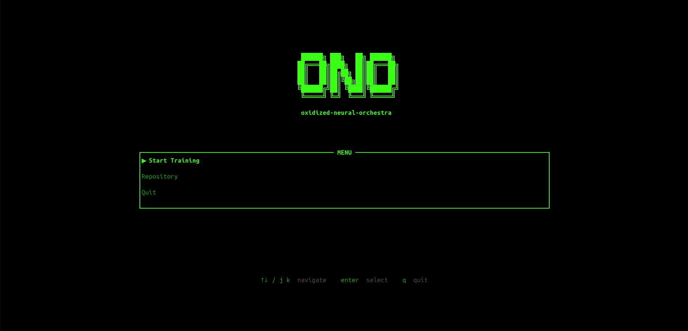
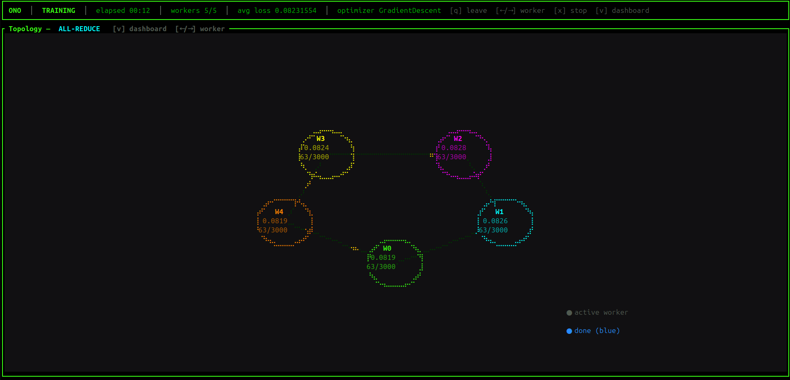
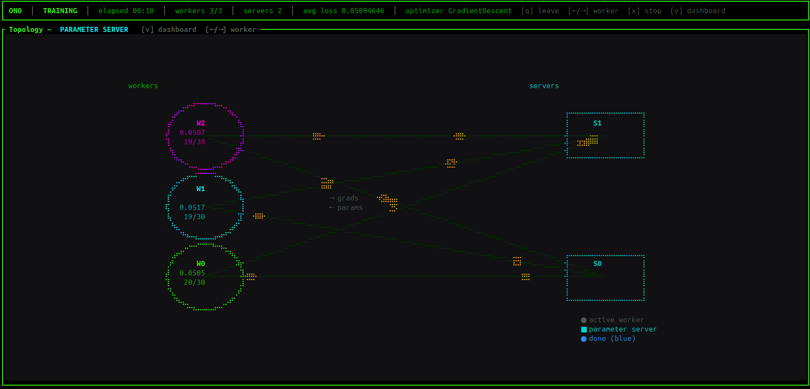
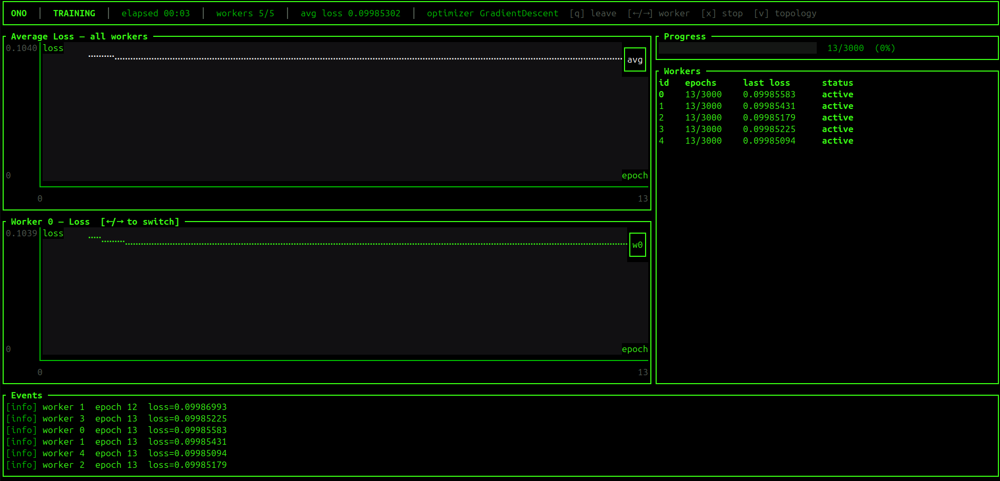

<p align="center">
  
</p>

<h1 align="center">Oxidized Neural Orchestra</h1>
<p align="center"><em>Distributed neural network training in Rust</em></p>

<p align="center">
  
  
  
</p>

---

## Overview

**O.N.O** is a fully distributed system for training neural networks, built from scratch in Rust. It supports three distributed training algorithms:

- **Parameter Server** — workers push gradients to centralized parameter servers, which apply updates and return the new parameters.
- **All-Reduce** — workers exchange and reduce gradients directly with each other, with no central server.
- **Strategy Switch** — starts as All-Reduce and automatically promotes workers into parameter servers once gradients converge.

The system exposes three interfaces:
- **`orchestui`** — an interactive TUI to configure and monitor training in real time
- **`orchestra-py`** — a Python-native module via PyO3 for programmatic use
- **`orchestrator`** — a headless Rust binary for Docker-based deployments

---

## Architecture

The **orchestrator** connects to all nodes, sends each one its configuration spec, and waits for training to complete. All nodes run the same `node` binary — the spec received at connection time determines whether a node acts as a worker or a parameter server.

### Parameter Server

```
         Orchestrator
              |
       +------+------+
       |             |
       v             v
    Worker  <---->  Server
   (N nodes)       (M nodes)
```

Workers train locally on their data partition and push gradients to the parameter servers. Servers apply updates and return the new parameters. Model parameters are sharded across servers.

### All-Reduce

```
        Orchestrator
             |
    +--------+--------+
    |        |        |
    v        v        v
 Worker  Worker  Worker
    |        |        |
    +--------+--------+
         (ring reduce)
```

Workers exchange and reduce gradients directly with each other — no parameter server needed. Each worker ends up with the same averaged gradient and applies it locally.

### Strategy Switch

Training begins as All-Reduce and, once gradients converge, the orchestrator promotes a subset of workers into parameter servers and continues as Parameter Server — combining the warm-up speed of All-Reduce with the scalability of Parameter Server.

---

## Running

O.N.O is a **distributed** system: every machine runs the same `node` binary, and one orchestrator connects to all of them, hands each its role, and drives training. Roles are **not** hardcoded — a node becomes a worker or a parameter server from the spec it receives on connection.

### Prerequisites
- Rust toolchain (`rustup`)
- Python 3.12+ and `maturin` (`pipx install maturin`) — only for `orchestra-py`
- Docker + Docker Compose — only to simulate a cluster on one machine

### 1. Start the nodes

On every machine that hosts a node, run the `node` binary with the port to listen on (`HOST` defaults to `0.0.0.0`):
```bash
PORT=40000 cargo run -p node --release
```
Run one per machine — or several on one machine, each on a different port. List every node's `host:port` in the `addrs` field of your `training.json`.

### 2. Drive the training

From any machine that can reach the nodes, pick one interface:

- **TUI** (`orchestui`):
  ```bash
  cargo run -p orchestui --release
  ```
  Enter the paths to your `model.json` / `training.json` (blank uses `model.json` / `training.json` in the current directory; press `?` for an inline example).

- **Python** (`orchestra-py`):
  ```bash
  cd orchestra-py && maturin develop && cd ..
  python3 orchestra-py/local.py
  ```

The orchestrator reads `addrs` from the config, connects to each node, and assigns roles automatically.

---

## The TUI

`orchestui` is an interactive dashboard to configure runs and watch training live.

**Main menu** — start a run, browse the trained-model repository, or quit.



**Topology — All-Reduce** — workers arranged in a ring, gradients flowing around it.



**Topology — Parameter Server** — workers on the left, servers on the right, with gradients and parameters streaming between them.



**Dashboard** — average and per-worker loss charts, a progress bar, the worker table, and a live event log.



---

## Simulating Locally with Docker

To run a whole cluster on a single machine, Docker can spin up `N` identical node containers:
```bash
python3 docker/compose_up.py --nodes N [--release]
```

This generates `compose.yaml` via `docker/gen_compose.py`, maps `node-i → 127.0.0.1` in `/etc/hosts` (requires sudo once) so the same `node-i:4000i` address resolves both from the host and between containers, and starts the containers — node `i` listens on port `40000 + i`. Then drive the run with `orchestui` or `orchestra-py` as above, pointing `addrs` at `node-0:40000`, `node-1:40001`, …

The `orchestui/run.sh` helper does it end to end: it reads the node count from `training.json`, brings the containers up, and opens the TUI.

You can also bring up a **single** node to try things out — with Docker (`--nodes 1`) or without (`PORT=40000 cargo run -p node`) — but the system is built to run distributed across machines.

---

## Config Files

### `model.json`
```json
{
  "layers": [
    { "dense": { "output_size": 8, "init": "kaiming", "act_fn": { "sigmoid": { "amp": 1.0 } } } },
    { "dense": { "output_size": 4, "init": "kaiming", "act_fn": { "sigmoid": { "amp": 1.0 } } } },
    { "dense": { "output_size": 1, "init": "kaiming" } }
  ]
}
```

### `training.json`

Two algorithm options — pick one:

**Parameter Server:**
```json
{
  "addrs": ["node-0:40000", "node-1:40001", "node-2:40002", "node-3:40003", "node-4:40004"],
  "algorithm": {
    "parameter_server": {
      "nservers": 2,
      "synchronizer": "barrier",
      "store": "blocking"
    }
  },
  "dataset": {
    "src": {
      "inline": {
        "samples": [1.0, 2.0, 3.0, 4.0],
        "labels": [2.0, 4.0, 6.0, 8.0]
      }
    },
    "x_size": 1,
    "y_size": 1
  },
  "optimizer": { "gradient_descent": { "lr": 0.01 } },
  "loss_fn": "mse",
  "batch_size": 4,
  "max_epochs": 500,
  "offline_epochs": 0,
  "seed": 42,
  "early_stopping": { "tolerance": 1e-4 }
}
```

**All-Reduce:**
```json
{
  "addrs": ["node-0:40000", "node-1:40001", "node-2:40002"],
  "algorithm": "all_reduce",
  "dataset": { ... },
  "optimizer": { "gradient_descent": { "lr": 0.01 } },
  "loss_fn": "mse",
  "batch_size": 4,
  "max_epochs": 500,
  "offline_epochs": 0
}
```

`addrs` lists every node; `nservers` (PS / Strategy Switch) sets how many of them become servers — the rest are workers.  
Synchronizer options (PS / Strategy Switch): `"barrier"` | `"non_blocking"`  
Store options (PS / Strategy Switch): `"blocking"` | `"wild"`  
`seed`, `serializer`, `early_stopping`, and `act_fn` are optional — omit them to use defaults.  
For a local dataset use `"src": { "local": { "samples_path": "...", "labels_path": "..." } }` instead of `inline`.

---

## Python API

### Parameter Server
```python
from orchestra import Sequential, orchestrate, parameter_server
from orchestra.arch import Dense
from orchestra.activations import Sigmoid
from orchestra.initialization import Kaiming
from orchestra.datasets import InlineDataset
from orchestra.optimizers import GradientDescent
from orchestra.loss_fns import Mse
from orchestra.sync import BarrierSync
from orchestra.store import BlockingStore

model = Sequential([
    Dense(8, Kaiming(), Sigmoid()),
    Dense(4, Kaiming(), Sigmoid()),
    Dense(1, Kaiming()),
])

samples = [1.0, 2.0, 3.0, 4.0]
labels  = [2.0, 4.0, 6.0, 8.0]

training = parameter_server(
    addrs=["node-0:40000", "node-1:40001", "node-2:40002", "node-3:40003", "node-4:40004"],
    nservers=2,
    dataset=InlineDataset(samples, labels, x_size=1, y_size=1),
    optimizer=GradientDescent(lr=0.01),
    loss_fn=Mse(),
    sync=BarrierSync(),
    store=BlockingStore(),
    max_epochs=500,
    batch_size=4,
)

session = orchestrate(model, training)
trained = session.wait()
trained.save_safetensors("weights.safetensors")
```

### All-Reduce
```python
from orchestra import Sequential, orchestrate, all_reduce
from orchestra.arch import Dense
from orchestra.initialization import Kaiming
from orchestra.datasets import InlineDataset
from orchestra.optimizers import GradientDescent
from orchestra.loss_fns import Mse

model = Sequential([Dense(8, Kaiming()), Dense(1, Kaiming())])

training = all_reduce(
    addrs=["node-0:40000", "node-1:40001", "node-2:40002"],
    dataset=InlineDataset(samples, labels, x_size=1, y_size=1),
    optimizer=GradientDescent(lr=0.01),
    loss_fn=Mse(),
    max_epochs=500,
    batch_size=4,
)

session = orchestrate(model, training)
trained = session.wait()
trained.save_safetensors("weights.safetensors")
```

---

## What's Implemented

| Feature | Status |
|---|---|
| Global architecture | ✅ |
| Parameter Server | ✅ |
| All-Reduce | ✅ |
| Strategy Switch | ✅ |

---

## Team

| Name | Student ID |
|---|---|
| Lorenzo Minervino | 107863 |
| Marcos Bianchi | 108921 |
| Alejo Ordoñez | 108397 |

**Universidad de Buenos Aires**  
Faculty of Engineering — Computer Engineering

---

## License

All rights reserved to the authors until project completion.