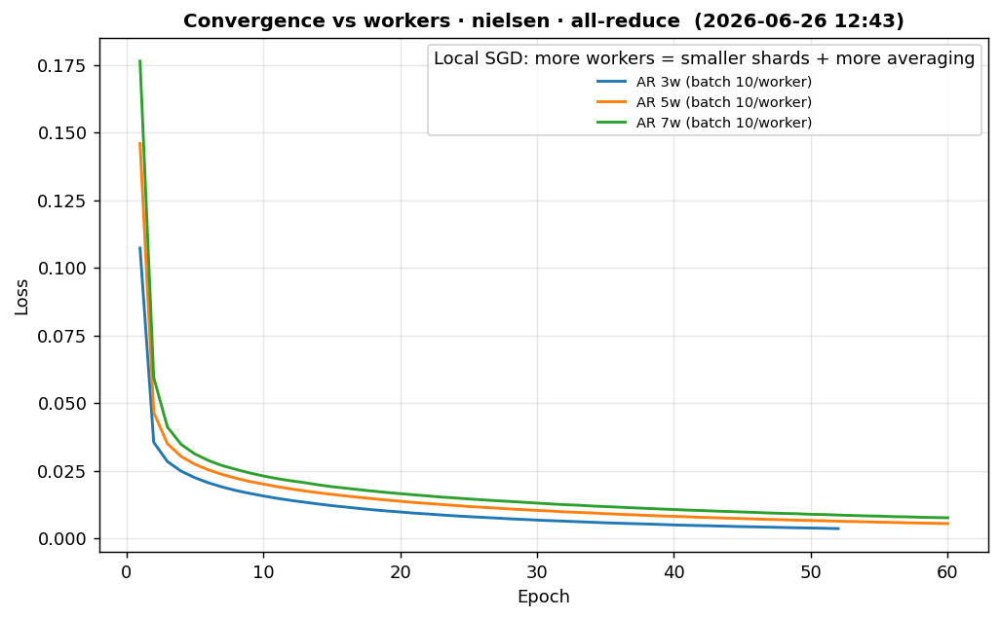
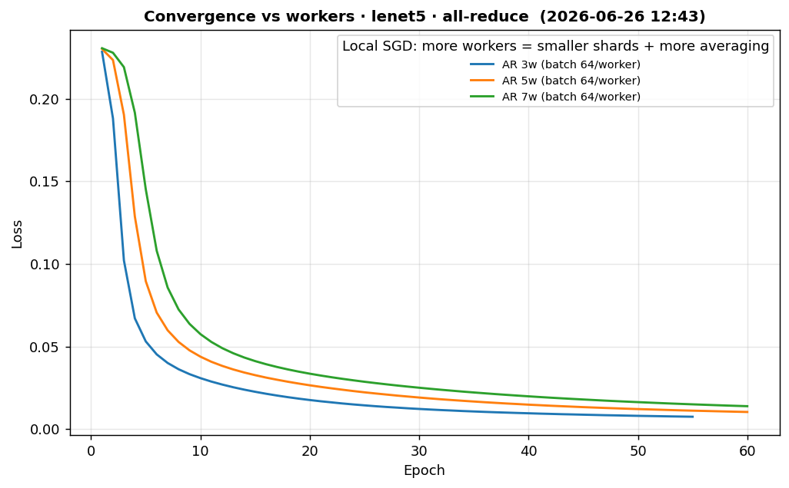

# Strategy Benchmarks

Compares the three distributed strategies — **parameter server**, **all-reduce** and **strategy switch** — on two models (**LeNet5** and **Nielsen MNIST**) across four focused suites. Each suite states what it measures and what it does not.

## Models

- **Nielsen MNIST**: `28×28×1 → conv(20, 5×5) → maxpool(2×2) → dense(100) → dense(10) → softmax`.
- **LeNet5**: `conv(6, 5×5, pad2) → maxpool → conv(16, 5×5) → maxpool → dense(120) → dense(84) → dense(10)`, tanh + softmax.

### Hyper-parameters

Each model owns its *reference* recipe (in `issue/suites.py`). Convergence suites train with it; speed/scalability suites override `batch`/`epochs` since they do not need to converge.

| Model | lr | Batch | Epochs | Loss |
|---|---|---|---|---|
| nielsen | 0.1 | 10 | 60 | cross_entropy |
| lenet5 | 0.05 | 64 | 60 | cross_entropy |

`batch` is the **per-worker** mini-batch (the dataset is sharded across workers, and each worker runs SGD locally at this batch before the per-epoch averaging). Nielsen uses the canonical `network3.py` recipe (60 / 10 / 0.1 → ~98.8%); the small batch is what lets the distributed runs converge.

## Strategies & variants

- **PS (blocking)** — `BlockingStore` + `BarrierSync`: workers wait for a full round.
- **AR** — all-reduce ring (averaged gradients).
- **SS** — strategy switch (starts in all-reduce, may switch to PS).
- **PyTorch (ref)** — single-process PyTorch training of the same architecture and recipe, drawn as a dashed reference line in the convergence plots.

## Running

```bash
.venv/bin/python benchmarks/run_issue_benchmarks.py                 # all suites, both models
.venv/bin/python benchmarks/run_issue_benchmarks.py --suite convergence
.venv/bin/python benchmarks/run_issue_benchmarks.py --suite scalability --model lenet5
.venv/bin/python benchmarks/run_issue_benchmarks.py --plots-only    # rebuild plots/README from history
```

Partial runs only re-run and re-plot the selected suite/model; every other suite keeps its previous results and figures.

All-reduce worker scale: [3, 5, 7] (configurable in `issue/suites.py`; the issue suggests 3/7/11 — kept lighter to fit one host).

_Last full run: 4h 40m 34s (2026-06-26 02:14)._

## Convergence

**Measures:** loss vs epoch and final test accuracy. Strategies are compared at a **fixed 3-worker** topology so the per-worker shard size and the cross-worker averaging frequency stay constant — the only fair way to attribute differences to the strategy. (Training is **Local SGD**: every worker runs SGD locally at `batch` per step over its data shard, then the updates are averaged across workers each epoch — the per-step batch is **not** `workers × batch`.) The all-reduce **worker-count sweep** lives in its own figure (more workers = smaller shards + more averaging). The dashed line is the single-process PyTorch reference (same recipe + same early-stopping rule).
**Does NOT measure:** wall-clock speed.

| Model | Strategy | Topology | Batch/wkr | Epochs | Final loss | Accuracy |
|---|---|---|---|---|---|---|
| lenet5 | AR | 3w | 64 | 55 | 0.00759 | 0.978 |
| lenet5 | AR | 5w | 64 | 60 | 0.0105 | 0.973 |
| lenet5 | AR | 7w | 64 | 60 | 0.014 | 0.963 |
| lenet5 | PS (blocking) | 3w/2s | 64 | 60 | 0.00723 | 0.980 |
| lenet5 | SS (blocking) · no switch | 3w/2s | 64 | 60 | 0.0105 | 0.973 |
| lenet5 | PyTorch (ref) | 1w | 64 | 60 | 0.00107 | 0.990 |
| nielsen | AR | 3w | 10 | 52 | 0.00361 | 0.984 |
| nielsen | AR | 5w | 10 | 60 | 0.00547 | 0.979 |
| nielsen | AR | 7w | 10 | 60 | 0.00762 | 0.975 |
| nielsen | PS (blocking) | 3w/2s | 10 | 60 | 0.00349 | 0.983 |
| nielsen | SS (blocking) · no switch | 3w/2s | 10 | 60 | 0.00547 | 0.979 |
| nielsen | PyTorch (ref) | 1w | 10 | 60 | 0.000222 | 0.989 |





## Execution speed

**Measures:** **samples/sec** (batch-invariant throughput) on a small subset. Compares raising `offline_epochs` vs raising `batch_size`.
**Does NOT measure:** accuracy or convergence.

| Model | Strategy | Topology | offline | batch | Samples/sec | Epochs/sec |
|---|---|---|---|---|---|---|
| lenet5 | AR | 3w | 0 | 64 | 2954 | 0.738 |
| lenet5 | AR | 3w | 4 | 64 | 2987 | 0.747 |
| lenet5 | AR | 3w | 0 | 256 | 3019 | 0.755 |
| nielsen | AR | 3w | 0 | 64 | 3824 | 0.956 |
| nielsen | AR | 3w | 4 | 64 | 3927 | 0.982 |
| nielsen | AR | 3w | 0 | 256 | 3685 | 0.921 |


## Convergence speed

**Measures:** loss reduction/sec and accuracy/sec under one shared fixed budget at the same worker count (only the strategy changes). SS rows state whether the switch fired.
**Does NOT measure:** peak accuracy.

| Model | Strategy | Topology | Loss/sec | Accuracy/sec |
|---|---|---|---|---|
| lenet5 | AR | 3w | 0.000271 | 0.00121 |
| lenet5 | PS (blocking) | 3w/2s | 0.000271 | 0.00121 |
| lenet5 | SS (blocking) · no switch | 3w/2s | 0.000323 | 0.00144 |
| nielsen | AR | 3w | 0.000164 | 0.00158 |
| nielsen | PS (blocking) | 3w/2s | 0.000145 | 0.00141 |
| nielsen | SS (blocking) · no switch | 3w/2s | 0.000246 | 0.00174 |


## Scalability

**Measures:** how **samples/sec** changes as workers increase, in **separate panels** for all-reduce and parameter server — PS spends extra server nodes, so the two do not share a 'workers' axis honestly (the node count is shown per point).
**Does NOT measure:** convergence (re-uses the speed budget).

| Model | Strategy | Workers | Nodes | Samples/sec |
|---|---|---|---|---|
| lenet5 | AR | 3 | 3 | 2982 |
| lenet5 | AR | 5 | 5 | 3607 |
| lenet5 | AR | 7 | 7 | 4450 |
| lenet5 | PS (blocking) | 2 | 3 | 2301 |
| lenet5 | PS (blocking) | 3 | 5 | 3034 |
| nielsen | AR | 3 | 3 | 3578 |
| nielsen | AR | 5 | 5 | 4709 |
| nielsen | AR | 7 | 7 | 5445 |
| nielsen | PS (blocking) | 2 | 3 | 3024 |
| nielsen | PS (blocking) | 3 | 5 | 3926 |


## Methodology & fairness

- **Local SGD, not large-batch.** Each worker runs SGD locally at the per-worker `batch` over its data shard, then the updates are averaged across workers each epoch (FedAvg-style). The per-step batch is **not** `workers × batch`. Adding workers shards the data finer and averages more often, which is what shifts convergence — so the strategy comparison fixes the worker count and the worker-count sweep is shown separately. The single-process baseline uses the same per-step batch, so it is a like-for-like reference, not an over-batched one.
- **Batch differs across suites.** Speed/scalability use a larger batch on a subset (they only need throughput), so their numbers do **not** transfer to the convergence config (e.g. Nielsen converges at batch 10 but is benchmarked for speed at batch 64/256 — ~6× faster there).
- **Throughput = samples/sec**, not epochs/sec: an epoch with a bigger batch has fewer steps, so epochs/sec would reward batch size by construction.
- **Loss scale.** The distributed `loss` is the mean across workers of each worker's epoch-mean cross-entropy; the PyTorch baseline is the global epoch-mean cross-entropy — same scale, directly comparable. (Early stopping on the distributed side keys off the per-epoch **max** worker loss; for the 1-worker baseline max = mean.)
- **Early stopping** (both distributed and baseline): stop after 3 consecutive epochs whose loss delta stays within `1e-4` (mirrors the orchestrator's `ConvergenceTracker`).
- **Repeats.** `--repeats N` repeats the throughput suites (execution-speed, scalability) N times — tables show `mean ± std` and bars carry error bars. The expensive convergence suites always run once (their loss/sec numbers are single-shot).

## Raw results

- Per-run records: `results/*.jsonl` (append-only, gitignored).
- Flattened table: `results/summary.csv`.
- Trained weights: `results/artifacts/*.safetensors`.

**Metrics:** `epochs_per_sec = epochs / train_seconds`; `samples_per_sec = samples × epochs / train_seconds`; `loss_per_sec = (first_loss − final_loss) / train_seconds`; `accuracy_per_sec = accuracy / train_seconds`.
