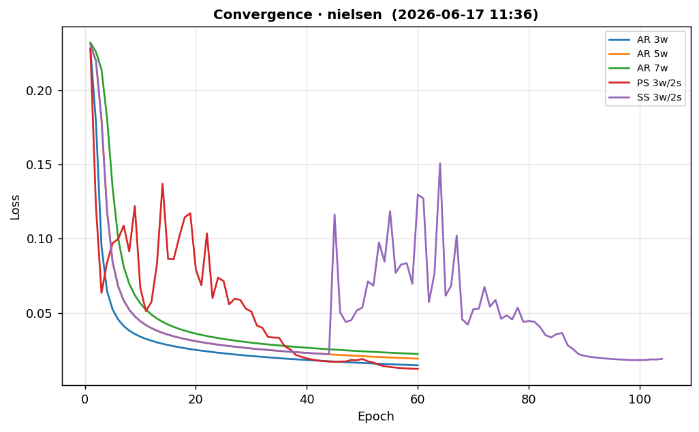
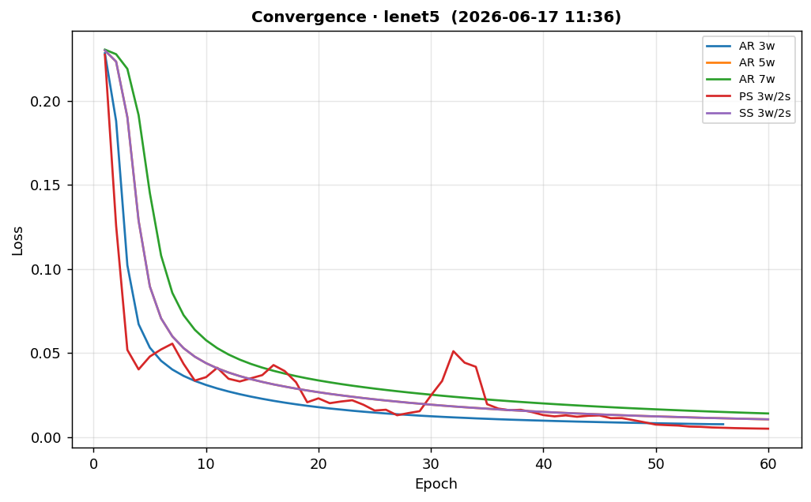
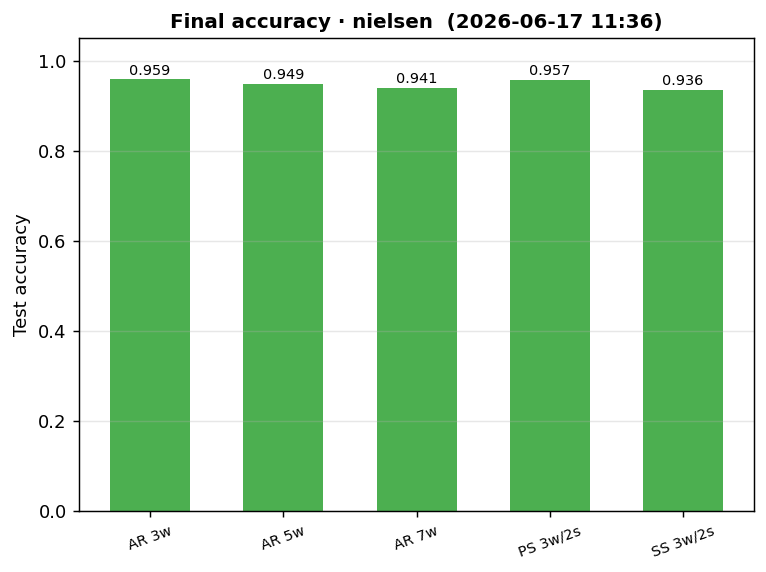
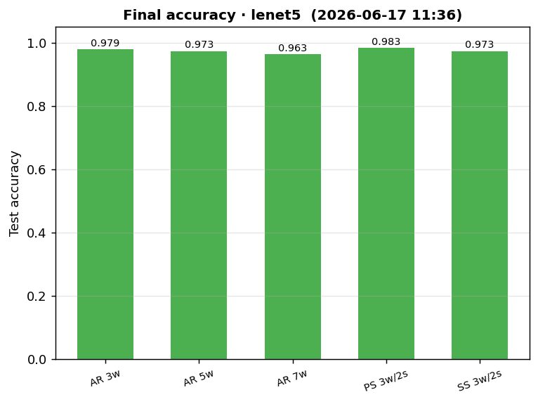
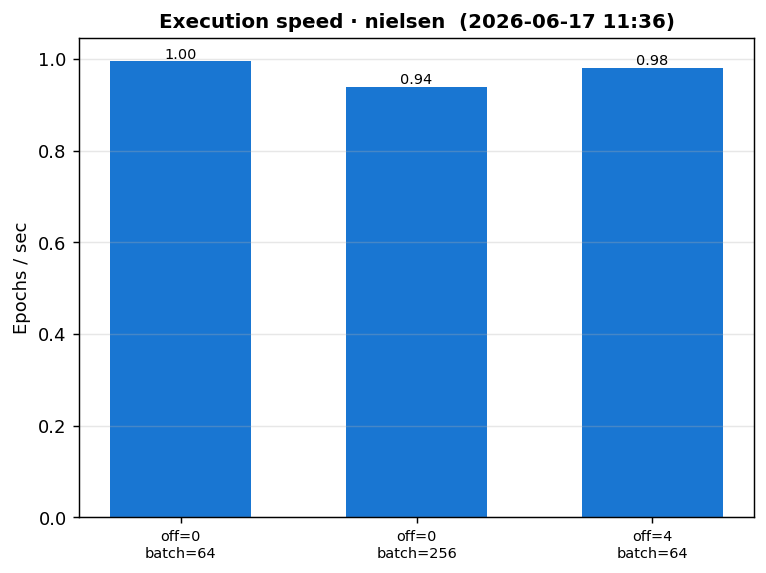
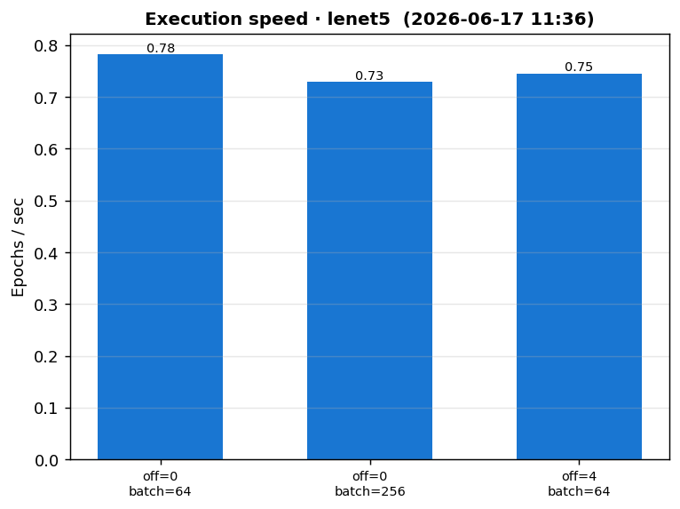
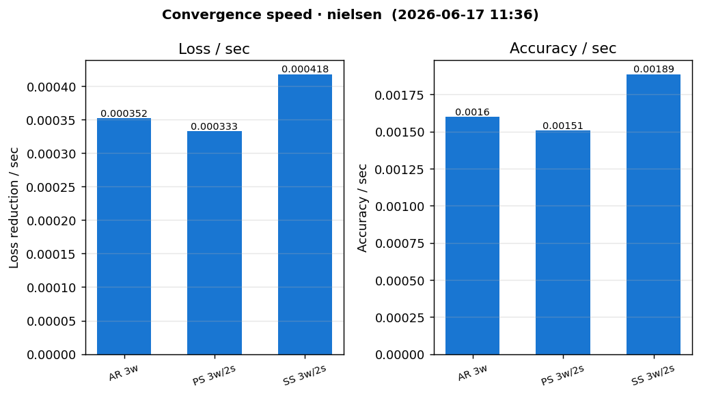
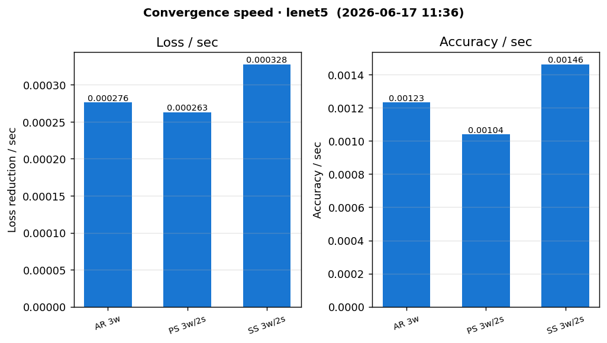
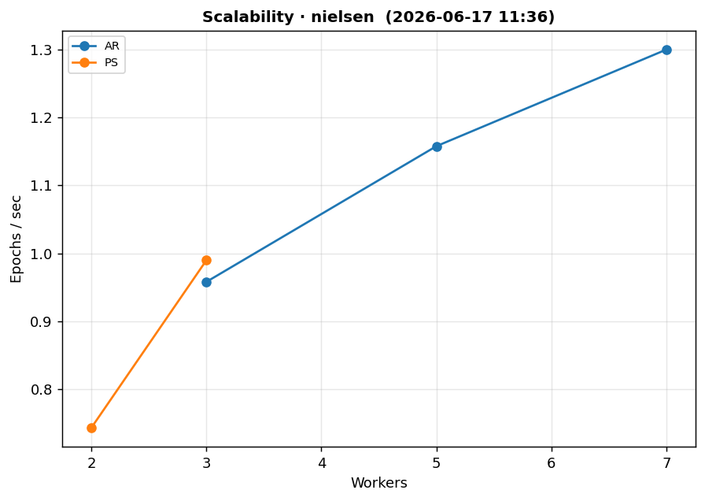
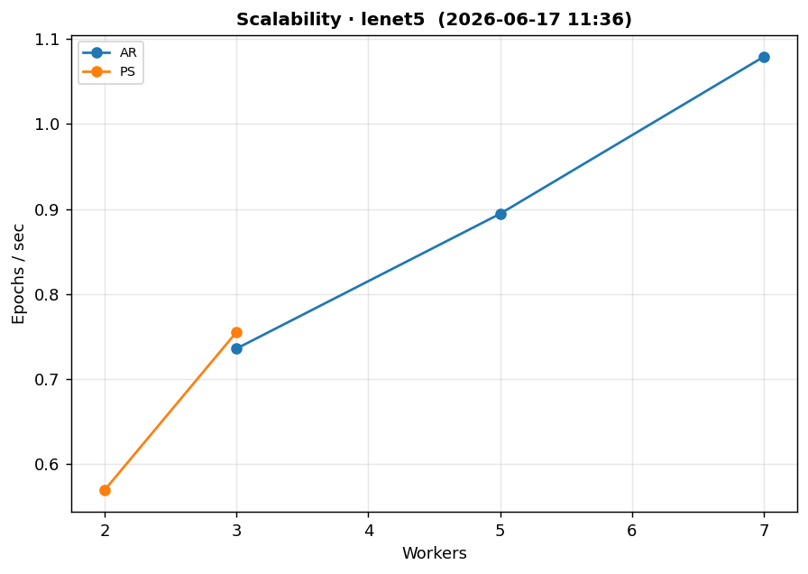

# Strategy Benchmarks

Compares the three distributed strategies — **parameter server**, **all-reduce** and **strategy switch** — on two models (**LeNet5** and **Nielsen MNIST**) across four focused suites. Each suite states what it measures and what it does not.

## Models

- **Nielsen MNIST**: `28×28×1 → conv(20, 5×5) → maxpool(2×2) → dense(100) → dense(10) → softmax`.
- **LeNet5**: `conv(6, 5×5, pad2) → maxpool → conv(16, 5×5) → maxpool → dense(120) → dense(84) → dense(10)`, tanh + softmax.

## Running

```bash
.venv/bin/python benchmarks/run_issue_benchmarks.py                 # all suites, both models
.venv/bin/python benchmarks/run_issue_benchmarks.py --suite convergence
.venv/bin/python benchmarks/run_issue_benchmarks.py --suite scalability --model lenet5
.venv/bin/python benchmarks/run_issue_benchmarks.py --plots-only    # rebuild plots/README from history
```

Partial runs only re-run and re-plot the selected suite/model; every other suite keeps its previous results and figures.

All-reduce worker scale: [3, 5, 7] (configurable in `issue/suites.py`; the issue suggests 3/7/11 — kept lighter to fit one host).

_Last full run: 3h 46m 30s (2026-06-17 05:06)._

## Convergence

**Measures:** loss vs epoch and final test accuracy per strategy/topology.
**Does NOT measure:** wall-clock speed.

| Model | Strategy | Topology | Epochs | Final loss | Accuracy |
|---|---|---|---|---|---|
| lenet5 | AR | 3w | 56 | 0.00756 | 0.979 |
| lenet5 | AR | 5w | 60 | 0.0105 | 0.973 |
| lenet5 | AR | 7w | 60 | 0.014 | 0.963 |
| lenet5 | PS | 3w/2s | 60 | 0.0049 | 0.983 |
| lenet5 | SS | 3w/2s | 60 | 0.0105 | 0.973 |
| nielsen | AR | 3w | 60 | 0.0146 | 0.959 |
| nielsen | AR | 5w | 60 | 0.0191 | 0.949 |
| nielsen | AR | 7w | 60 | 0.0223 | 0.941 |
| nielsen | PS | 3w/2s | 60 | 0.0122 | 0.957 |
| nielsen | SS | 3w/2s | 104 | 0.019 | 0.936 |






## Execution speed

**Measures:** epochs/sec on a small subset (no convergence). Compares raising `offline_epochs` vs raising `batch_size`.
**Does NOT measure:** accuracy or convergence.

| Model | Strategy | Topology | offline | batch | Epochs/sec |
|---|---|---|---|---|---|
| lenet5 | AR | 3w | 0 | 64 | 0.782 |
| lenet5 | AR | 3w | 4 | 64 | 0.745 |
| lenet5 | AR | 3w | 0 | 256 | 0.729 |
| nielsen | AR | 3w | 0 | 64 | 0.995 |
| nielsen | AR | 3w | 4 | 64 | 0.981 |
| nielsen | AR | 3w | 0 | 256 | 0.939 |




## Convergence speed

**Measures:** loss reduction/sec and accuracy/sec under one shared budget (same epochs and params; only the strategy changes).
**Does NOT measure:** peak accuracy.

| Model | Strategy | Topology | Loss/sec | Accuracy/sec |
|---|---|---|---|---|
| lenet5 | AR | 3w | 0.000276 | 0.00123 |
| lenet5 | PS | 3w/2s | 0.000263 | 0.00104 |
| lenet5 | SS | 3w/2s | 0.000328 | 0.00146 |
| nielsen | AR | 3w | 0.000352 | 0.0016 |
| nielsen | PS | 3w/2s | 0.000333 | 0.00151 |
| nielsen | SS | 3w/2s | 0.000418 | 0.00189 |




## Scalability

**Measures:** how throughput (epochs/sec) changes as nodes increase.
**Does NOT measure:** convergence (re-uses the speed budget).

| Model | Strategy | Workers | Epochs/sec |
|---|---|---|---|
| lenet5 | AR | 3 | 0.736 |
| lenet5 | AR | 5 | 0.894 |
| lenet5 | AR | 7 | 1.08 |
| lenet5 | PS | 2 | 0.569 |
| lenet5 | PS | 3 | 0.755 |
| nielsen | AR | 3 | 0.958 |
| nielsen | AR | 5 | 1.16 |
| nielsen | AR | 7 | 1.3 |
| nielsen | PS | 2 | 0.743 |
| nielsen | PS | 3 | 0.99 |




## Raw results

- Per-run records: `results/*.jsonl` (append-only, gitignored).
- Flattened table: `results/summary.csv`.
- Trained weights: `results/artifacts/*.safetensors`.

**Metrics:** `epochs_per_sec = epochs / train_seconds`; `loss_per_sec = (first_loss − final_loss) / train_seconds`; `accuracy_per_sec = accuracy / train_seconds`.
