# Strategy Benchmarks

Compares the three distributed strategies — **parameter server**, **all-reduce** and **strategy switch** — on two models (**LeNet5** and **Nielsen MNIST**) across four focused suites. Each suite states what it measures and what it does not.

## Models

- **Nielsen MNIST**: `28×28×1 → conv(20, 5×5) → maxpool(2×2) → dense(100, sigmoid) → dense(10) → softmax`.
- **LeNet5**: `conv(6, 5×5, pad2) → maxpool → conv(16, 5×5) → maxpool → dense(120) → dense(84) → dense(10)`, tanh + softmax.

### Hyper-parameters

Each model owns its *reference* recipe (in `issue/suites.py`). Convergence suites train with it; speed/scalability suites override `batch`/`epochs` since they do not need to converge.

| Model | lr | Batch | Epochs | Loss |
|---|---|---|---|---|
| nielsen | 0.1 | 10 | 60 | cross_entropy |
| lenet5 | 0.05 | 64 | 60 | cross_entropy |

`batch` is the **per-worker** mini-batch (the dataset is sharded across workers, and each worker runs SGD locally at this batch before the per-epoch averaging). Nielsen uses the canonical `network3.py` recipe (60 / 10 / 0.1 → ~98.8%); the small batch is what lets the distributed runs converge.

## Strategies & variants

- **PS (blocking)** — `BlockingStore` + `BarrierSync`: workers wait for a full round.
- **PS (non-block)** — `BlockingStore` + `NonBlockingSync`: same consistent store, but workers apply and move on without the barrier (see Methodology for why the lock-free HogWild store is excluded).
- **AR** — all-reduce ring (averaged gradients).
- **SS** — strategy switch (starts in all-reduce, may switch to PS).
- **PyTorch (ref)** — single-process PyTorch training of the same architecture and recipe, drawn as a dashed reference line in the convergence plots.

## Running

```bash
.venv/bin/python benchmarks/run_issue_benchmarks.py                 # all suites, both models
.venv/bin/python benchmarks/run_issue_benchmarks.py --suite convergence
.venv/bin/python benchmarks/run_issue_benchmarks.py --suite scalability --model lenet5
.venv/bin/python benchmarks/run_issue_benchmarks.py --plots-only    # rebuild plots/README from history
```

Partial runs only re-run and re-plot the selected suite/model; every other suite keeps its previous results and figures.

All-reduce worker scale: [3, 5, 7] (configurable in `issue/suites.py`; the issue suggests 3/7/11 — kept lighter to fit one host).

_Last full run: 4h 24m 41s (2026-06-28 22:57)._

## Convergence

**Measures:** loss vs epoch and final test accuracy. Strategies are compared at a **fixed 5-node budget** (PS and SS are 3 workers + 2 servers; all-reduce runs 5 workers) so they spend the same hardware. We hold **nodes** fixed rather than **workers** because strategy switch all-reduces over *every* node until it switches, so a 3w/2s SS is really a 5-node run; at equal node budget it sits honestly next to all-reduce with that many workers instead of being mislabeled as a 3-worker run. (Training is **Local SGD**: every worker runs SGD locally at `batch` per step over its data shard, then the updates are averaged across workers each epoch — the per-step batch is **not** `workers × batch`.) The all-reduce **worker-count sweep** lives in its own figure (more workers = smaller shards + more averaging). The dashed line is the single-process PyTorch reference (same recipe + same early-stopping rule).
**Does NOT measure:** wall-clock speed.

| Model | Strategy | Topology | lr | Batch/wkr | Epochs | Final loss | Accuracy |
|---|---|---|---|---|---|---|---|
| lenet5 | AR | 3w | 0.05 | 64 | 56 | 0.00756 | 0.978 |
| lenet5 | AR | 5w | 0.05 | 64 | 60 | 0.0105 | 0.973 |
| lenet5 | AR | 7w | 0.05 | 64 | 60 | 0.014 | 0.963 |
| lenet5 | PS (blocking) | 3w/2s | 0.05 | 64 | 60 | 0.00723 | 0.980 |
| lenet5 | PS (non-block) | 3w/2s | 0.05 | 64 | 60 | 0.00738 | 0.980 |
| lenet5 | SS (blocking) · no switch | 3w/2s | 0.05 | 64 | 60 | 0.0105 | 0.973 |
| lenet5 | PyTorch (ref) | 1w | 0.05 | 64 | 60 | 0.00107 | 0.990 |
| nielsen | AR | 3w | 0.1 | 10 | 52 | 0.00361 | 0.984 |
| nielsen | AR | 5w | 0.1 | 10 | 60 | 0.00547 | 0.979 |
| nielsen | AR | 7w | 0.1 | 10 | 60 | 0.00762 | 0.975 |
| nielsen | PS (blocking) | 3w/2s | 0.1 | 10 | 60 | 0.00349 | 0.983 |
| nielsen | PS (non-block) | 3w/2s | 0.1 | 10 | 60 | 0.00374 | 0.981 |
| nielsen | SS (blocking) · no switch | 3w/2s | 0.1 | 10 | 60 | 0.00547 | 0.979 |
| nielsen | PyTorch (ref) | 1w | 0.1 | 10 | 60 | 0.000222 | 0.989 |

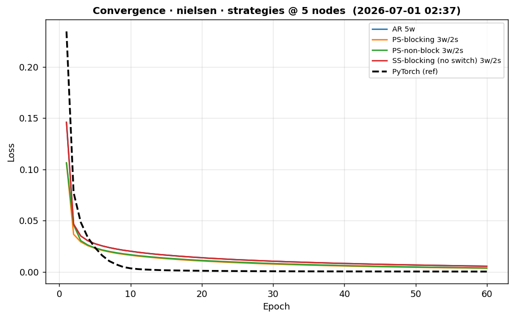
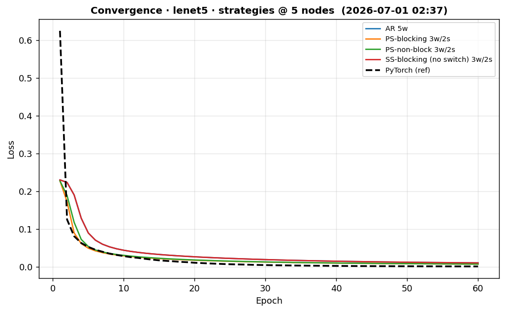
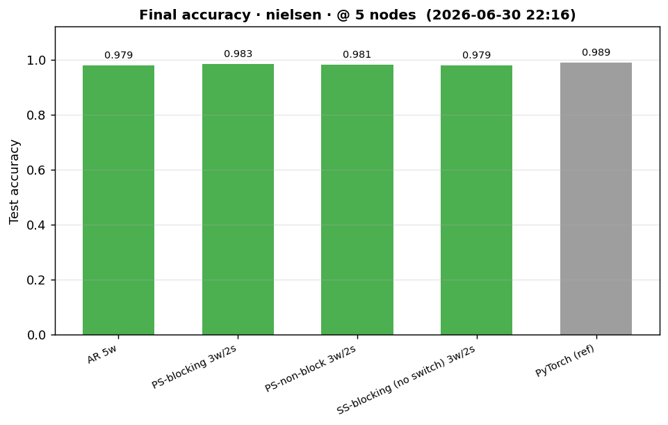
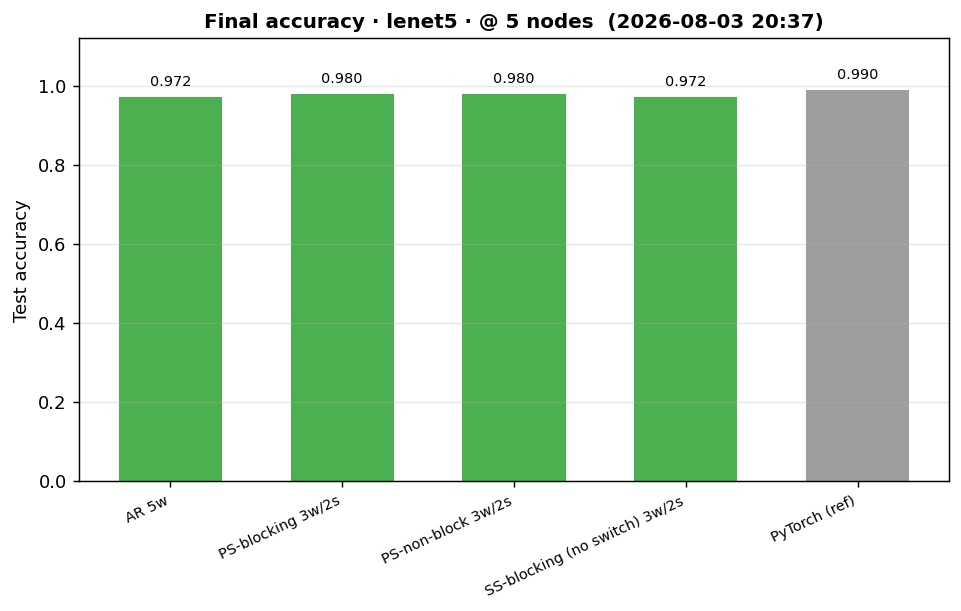
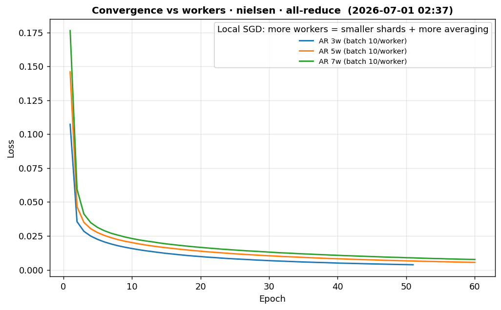
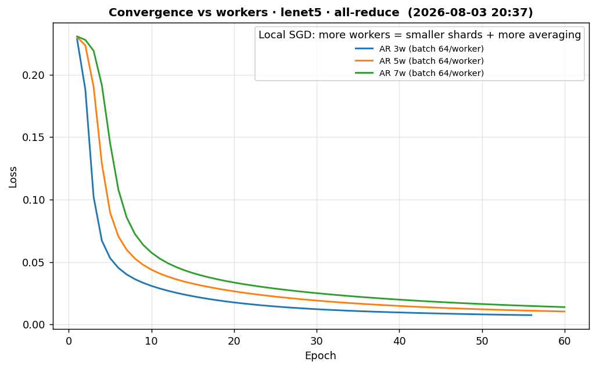

## Execution speed

**Measures:** **samples/sec** (batch-invariant throughput) on a fixed **4,000-sample** training subset over a short **8-epoch** budget. Compares raising `offline_epochs` vs raising `batch_size`.
**Does NOT measure:** accuracy or convergence.

| Model | Strategy | Topology | offline | batch | Samples/sec |
|---|---|---|---|---|---|
| lenet5 | AR | 3w | 0 | 64 | 3015 ± 57 |
| lenet5 | AR | 3w | 4 | 64 | 2976 ± 104 |
| lenet5 | AR | 3w | 0 | 256 | 2921 ± 5 |
| nielsen | AR | 3w | 0 | 64 | 3927 ± 165 |
| nielsen | AR | 3w | 4 | 64 | 3553 ± 6 |
| nielsen | AR | 3w | 0 | 256 | 3593 ± 147 |

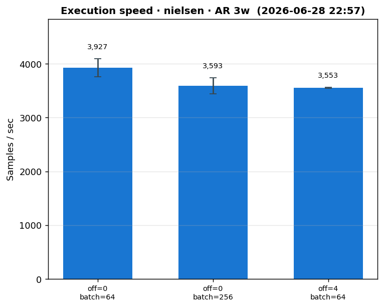
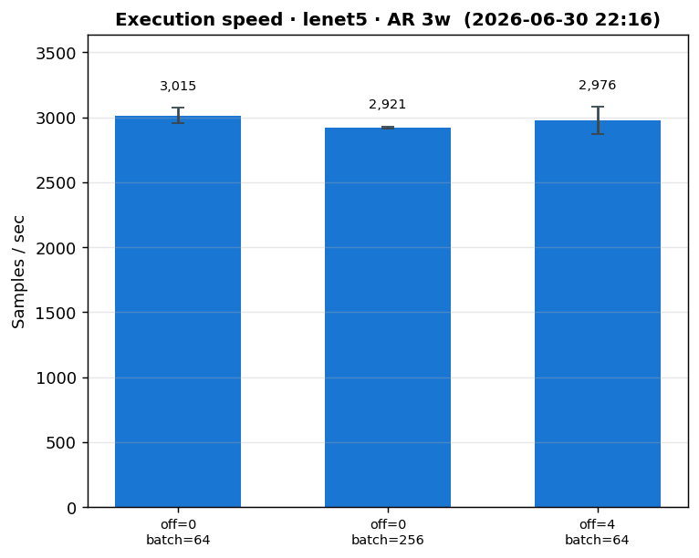

## Convergence speed

**Measures:** loss reduction/sec and accuracy/sec under one shared fixed budget at the same 5-node budget (only the strategy changes), plus raw **samples/sec** as a throughput reference decoupled from convergence quality. SS rows state whether the switch fired.
**Does NOT measure:** peak accuracy.

| Model | Strategy | Topology | Samples/sec | Loss/sec | Accuracy/sec |
|---|---|---|---|---|---|
| lenet5 | AR | 5w | 3644 | 0.000327 | 0.00146 |
| lenet5 | PS (blocking) | 3w/2s | 2888 | 0.000262 | 0.00117 |
| lenet5 | PS (non-block) | 3w/2s | 2602 | 0.000236 | 0.00106 |
| lenet5 | SS (blocking) · no switch | 3w/2s | 3649 | 0.000327 | 0.00146 |
| nielsen | AR | 5w | 4193 | 0.000241 | 0.0017 |
| nielsen | PS (blocking) | 3w/2s | 3553 | 0.000149 | 0.00145 |
| nielsen | PS (non-block) | 3w/2s | 3334 | 0.000139 | 0.00136 |
| nielsen | SS (blocking) · no switch | 3w/2s | 4330 | 0.000249 | 0.00176 |

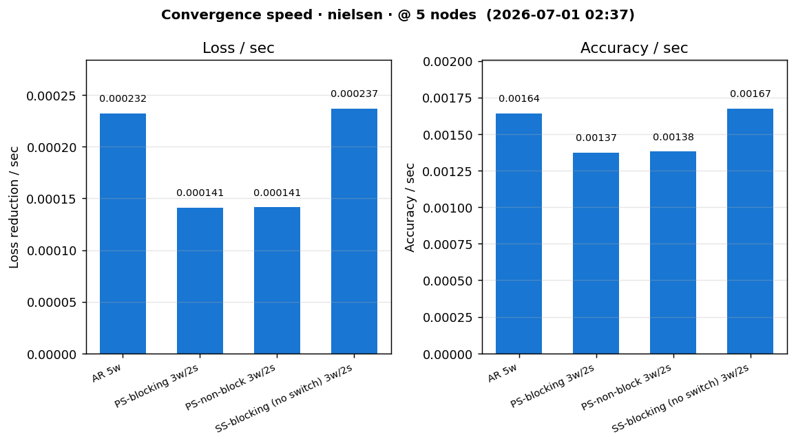
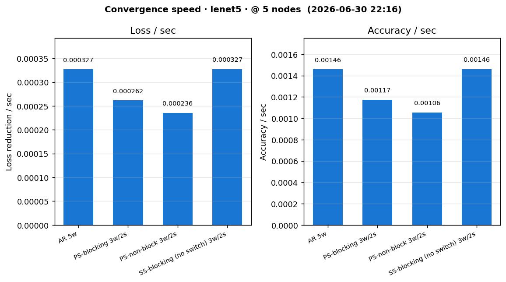

## Scalability

**Measures:** how **samples/sec** changes as workers increase, on the same fixed **4,000-sample** subset, in **separate panels** for all-reduce and parameter server — PS spends extra server nodes, so the two do not share a 'workers' axis honestly (the node count is shown per point).
**Does NOT measure:** convergence (re-uses the speed budget).

| Model | Strategy | Workers | Nodes | Samples/sec |
|---|---|---|---|---|
| lenet5 | AR | 3 | 3 | 2979 ± 165 |
| lenet5 | AR | 5 | 5 | 3607 ± 28 |
| lenet5 | AR | 7 | 7 | 4193 ± 236 |
| lenet5 | PS (blocking) | 3 | 5 | 3013 ± 24 |
| lenet5 | PS (blocking) | 5 | 7 | 3924 ± 36 |
| nielsen | AR | 3 | 3 | 3688 ± 183 |
| nielsen | AR | 5 | 5 | 4622 ± 38 |
| nielsen | AR | 7 | 7 | 5213 ± 191 |
| nielsen | PS (blocking) | 3 | 5 | 3962 ± 4 |
| nielsen | PS (blocking) | 5 | 7 | 5049 ± 59 |

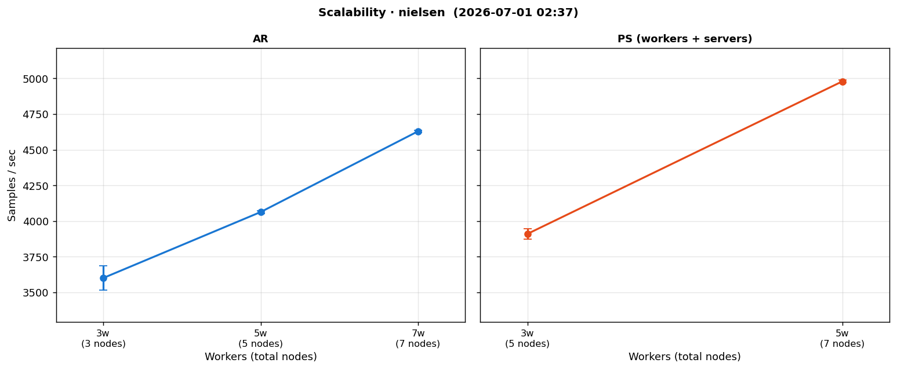
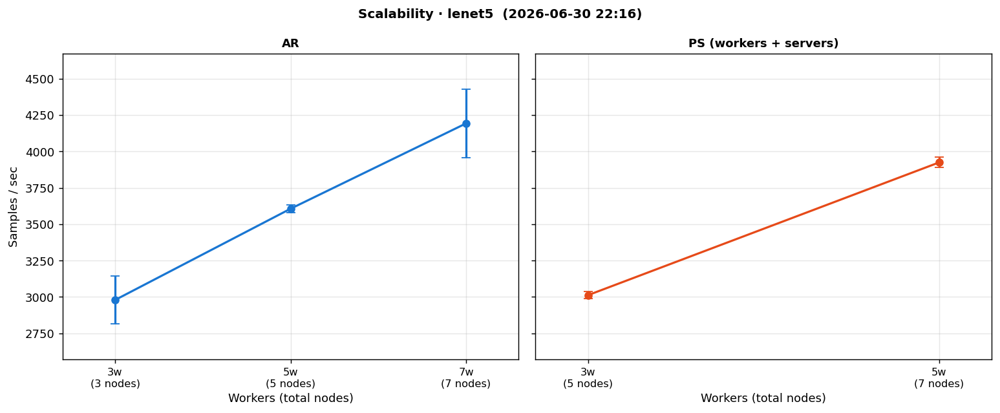

## Methodology & fairness

- **Local SGD, not large-batch.** Each worker runs SGD locally at the per-worker `batch` over its data shard, then the updates are averaged across workers each epoch (FedAvg-style). The per-step batch is **not** `workers × batch`. Adding workers shards the data finer and averages more often, which is what shifts convergence — so the strategy comparison fixes the total node budget (workers + servers) and the worker-count sweep is shown separately. The single-process baseline uses the same per-step batch, so it is a like-for-like reference, not an over-batched one.
- **Batch differs across suites.** Speed/scalability use a larger batch on a subset (they only need throughput), so their numbers do **not** transfer to the convergence config (e.g. Nielsen converges at batch 10 but is benchmarked for speed at batch 64/256 — ~6× faster there).
- **Throughput = samples/sec, not epochs/sec.** By construction `epochs_per_sec = samples_per_sec / samples_per_epoch`, and samples-per-epoch is **fixed within each suite** (the subset for the speed suites, the full set for the convergence ones). So next to samples/sec, epochs/sec is the *same* ranking rescaled by a constant — it carries no extra information within a figure, which is why it is **not** added per-suite. samples/sec is the one kept because it is invariant: it counts real work, so it stays comparable across batch sizes and across datasets, whereas an 'epoch' means 4k samples in the speed suites but 60k in the convergence ones — not comparable.
- **Data sizes.** Convergence and convergence-speed train on the **full 60,000-sample MNIST** training set; execution-speed and scalability train on a fixed **4,000-sample** subset (throughput only). Accuracy is always scored on the full **10,000-sample** test set (`t10k`).
- **PS synchronizer variants.** Parameter server is benchmarked in two variants that share the **consistent `BlockingStore`** and differ only in the synchronizer, so the comparison isolates the barrier: **blocking** (`BarrierSync` — every worker waits for the full aggregation round) vs **non_blocking** (`NonBlockingSync` — workers apply and move on without the barrier). The lock-free `WildStore` (HogWild) is **deliberately excluded**: its data races make a run hang non-deterministically (it completed some trial runs and hung mid-epoch on others), so it has no fair, reproducible number.
- **Accuracy** is measured **once, after training**, over the **full 10,000-sample MNIST test set** (`t10k`): the trained weights are loaded into the PyTorch argmax reference and scored on every test sample — not sampled, not evaluated periodically, so there is no mid-training eval cost folded into `train_seconds`.
- **What `train_seconds` measures.** Host wall-clock of `orchestrate().wait()`. Every node runs as a Docker container **on a single host**, so (a) compute runs in genuine parallel only up to the host core count (~8 cores here — readings past ~8 total nodes oversubscribe and stop being honest) and (b) the network is **loopback**, so inter-node communication is far cheaper than a real multi-machine cluster. Read samples/sec and scalability as a **single-host lower bound on comms cost**, not a true distributed measurement.
- **`loss/sec` and `accuracy/sec` divide by total time**, so they reward raw speed: a faster strategy that plateaus at a slightly lower final accuracy can still score higher than a slower one that converges better. Always read them next to the final accuracy, never alone.
- **PS blocking vs non_blocking is compared on accuracy, not speed.** The two PS variants are contrasted by their **converged accuracy** (reproducible from the seed, host-load-independent): removing the barrier costs almost nothing (nielsen 98.30 → 98.13, lenet5 98.0 ≈ 98.0). Their **timing** is *not* compared: convergence-speed runs once (repeats=1), and single-shot `train_seconds` on this host carries ~±25% between-run noise (seen directly in the prior campaign, where the same blocking config timed 831 s and 658 s), which swamps any real blocking/non_blocking difference. The non_blocking rows are also from a later campaign than AR/SS, so cross-strategy *speed* here is only indicative — a same-session, repeated re-benchmark is pending.
- **Loss scale.** The distributed `loss` is the mean across workers of each worker's epoch-mean cross-entropy; the PyTorch baseline is the global epoch-mean cross-entropy — same scale, directly comparable. (Early stopping on the distributed side keys off the per-epoch **max** worker loss; for the 1-worker baseline max = mean.)
- **Cross-entropy on logits, softmax once.** The PyTorch baseline computes the loss with `F.cross_entropy` on raw logits, which folds the softmax into the loss, so the distribution is normalized once — same softmax-then-cross-entropy the orchestra trainer applies. The final softmax is only materialized for the argmax accuracy, where it does not change the result.
- **Early stopping** (both distributed and baseline): stop after 3 consecutive epochs whose loss delta stays within `1e-4` (mirrors the orchestrator's `ConvergenceTracker`).
- **Repeats.** `--repeats N` repeats the throughput suites (execution-speed, scalability) N times — tables show `mean ± std` and bars carry error bars. The expensive convergence suites always run once (their loss/sec numbers are single-shot).

## Raw results

- Per-run records: `results/*.jsonl` (append-only, gitignored).
- Flattened table: `results/summary.csv`.
- Trained weights: `results/artifacts/*.safetensors`.

**Metrics:** `epochs_per_sec = epochs / train_seconds`; `samples_per_sec = samples × epochs / train_seconds`; `loss_per_sec = (first_loss − final_loss) / train_seconds`; `accuracy_per_sec = accuracy / train_seconds`.
