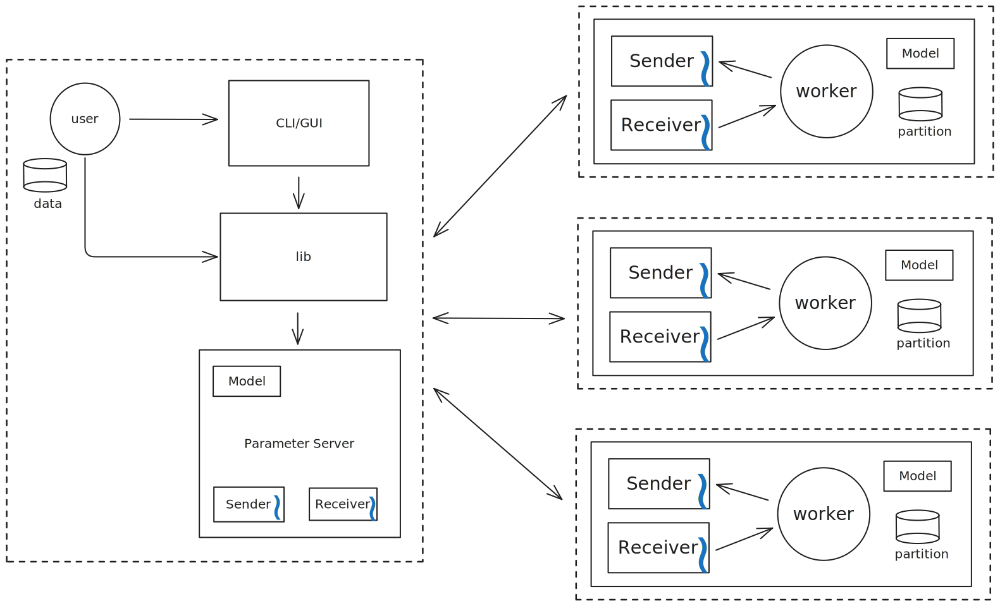

# architecture draft

## diagrams
### high-level architecture

### class diagram

## message types
Messages that are going to be supported by the system are:

- **handshaking phase**
    - **first phase**
        1. benchmark info
    - **second phase**
        2. data partitions
        3. initial weights
        - **model architecture**
            4. layers and per-layer density (mlp)

- **training phase**
    - **data messages**
        - matrix
            - gradients
            - weights
    - **control messages**
        - start
        - stop
        - ...
