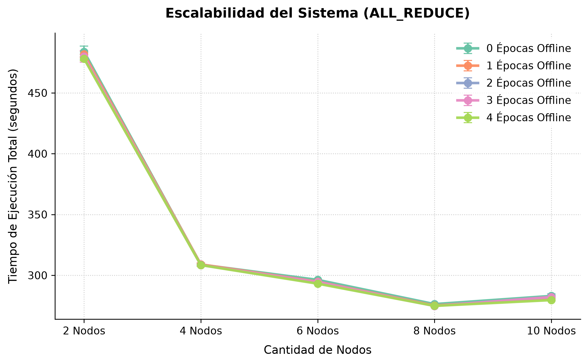
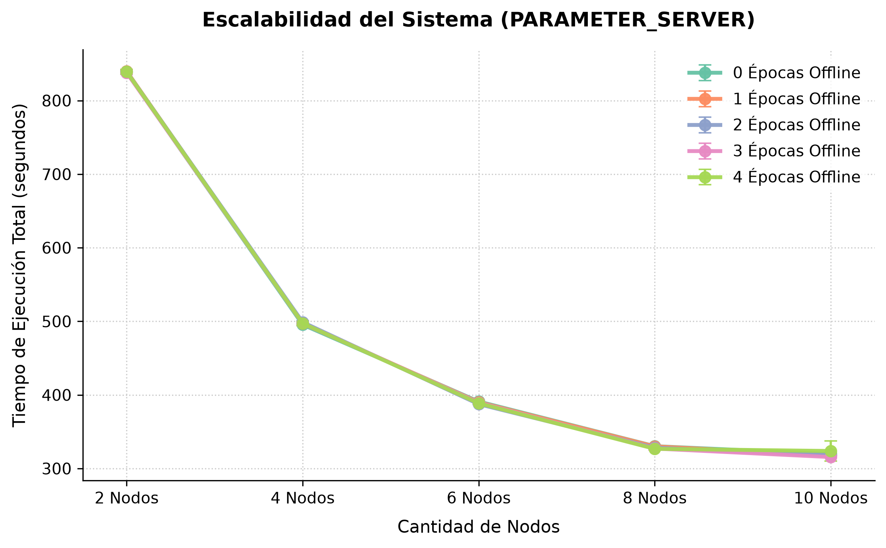
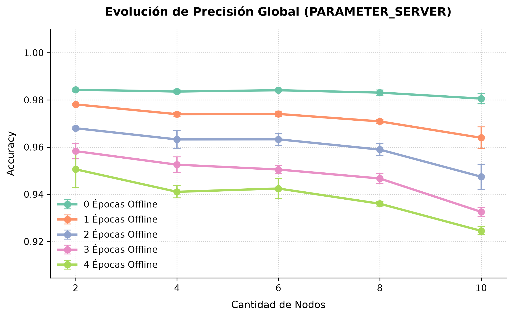
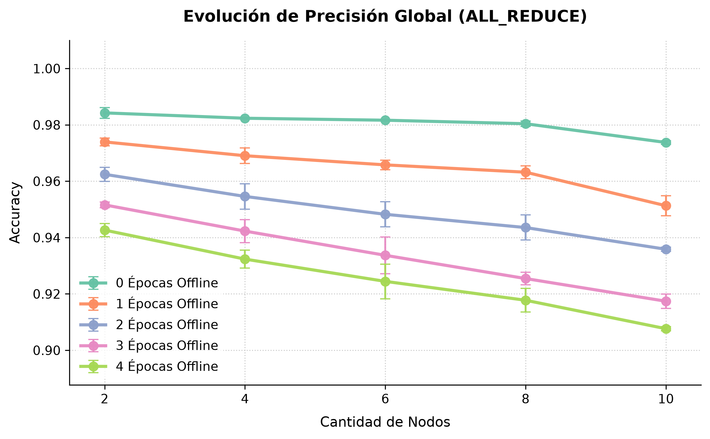
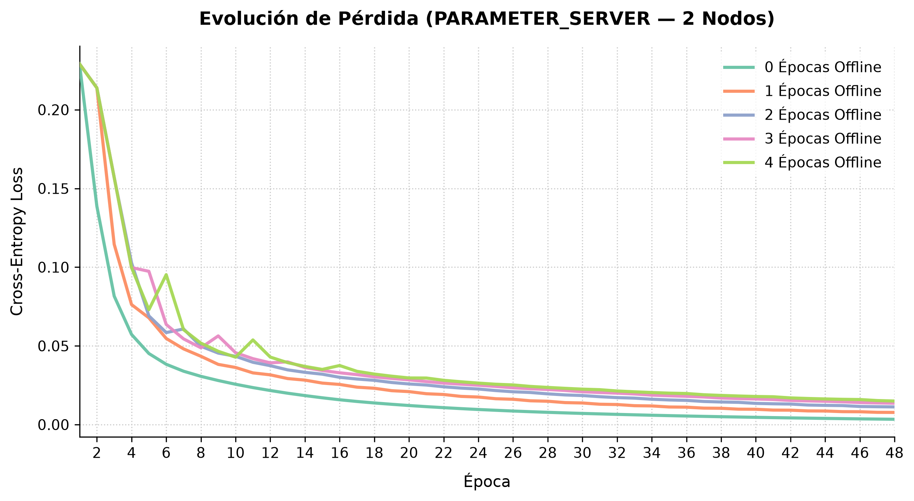
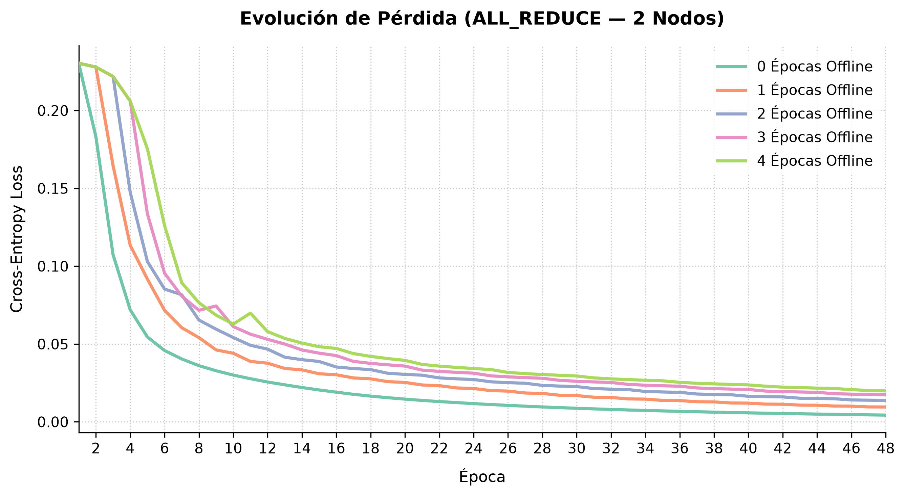

\newpage
# Experimentación y validación

La validación se apoyó en dos frentes. El primero es el de las pruebas automatizadas, que verifican que el sistema hace lo que dice hacer. El segundo, y el que da sentido al proyecto, es el de los estudios experimentales: como O.N.O. fue concebido para comparar estrategias de distribución de forma controlada, la validación última consiste en demostrar que esa base produce evidencia comparable.

Los estudios se organizan como tres investigaciones independientes, cada una con su pregunta, su metodología y sus conclusiones acotadas al entorno evaluado. Las tres corren sobre la misma base, de modo que la única variable entre configuraciones es aquella que cada estudio se propone aislar.

## Pruebas automatizadas

El sistema se verificó con tres tipos de pruebas. Las pruebas unitarias ejercitan cada componente de forma aislada y son las que sostienen el motor de redes neuronales: la corrección de la propagación hacia atrás no es observable a simple vista, y la única manera práctica de detectar un gradiente mal derivado es contrastarlo contra un valor calculado de forma independiente. Las pruebas de integración validan la interacción entre nodos durante una ejecución distribuida, en particular los protocolos de coordinación. Las pruebas de aceptación comprueban que cada funcionalidad requerida se comporta como fue especificada, ejecutando un entrenamiento completo sobre el entorno simulado y verificando que la convergencia obtenida sea consistente con la del entrenamiento secuencial equivalente.

Las dos primeras se escribieron con el arnés de pruebas nativo de Rust y se ejecutan mediante `cargo test`; las de aceptación se levantan sobre los entornos contenedizados descritos más abajo. Las tres son automatizadas y de ejecución desatendida, y se versionan junto con el código, de modo que cada cambio pueda validarse antes de integrarse.

## Entorno de experimentación y reproducibilidad

El despliegue se realiza con una única imagen de Docker, coherente con el agnosticismo de rol del sistema: no hay imagen de trabajador ni imagen de servidor. Un conjunto de scripts genera la configuración del clúster, ajusta la resolución de nombres y levanta el entorno a partir de un único parámetro con la cantidad de nodos.

Todas las mediciones se realizaron sobre clústeres simulados en una única máquina física: un contenedor por nodo, red *bridge* y puertos publicados. Esta decisión, tomada al inicio del trabajo por la imposibilidad de disponer de múltiples máquinas dedicadas, es la limitación transversal a los tres estudios y condiciona la lectura de todos los resultados de rendimiento. La infraestructura no fija afinidad de núcleos, no limita CPU por contenedor y no emula latencia ni ancho de banda: al aumentar la cantidad de nodos los núcleos físicos se saturan, de modo que lo que se mide es escalado lógico bajo recursos compartidos y no escalado multimáquina. La red, además, es efectivamente loopback, lo que favorece sistemáticamente a las estrategias que comunican más y hace que los tiempos medidos sean una cota inferior del costo de comunicación.

Esta es la única declaración de la limitación en el informe, y los tres estudios se leen bajo ella. Para separar lo que es propiedad de un algoritmo de lo que es artefacto del entorno, los resultados de tiempo se acompañan de la métrica analítica que se introduce en el primer estudio.

La suite de experimentación está escrita en Python y organizada de forma declarativa en cuatro conjuntos de ensayos que miden convergencia, velocidad de ejecución, velocidad de convergencia y escalabilidad. Persiste los resultados de forma incremental, agrega repeticiones en media y desvío, y regenera su propia documentación en cada corrida. Documenta además de forma explícita sus criterios de equidad y sus fuentes de ruido: justifica el presupuesto fijo de nodos, aclara qué significa una época en cada ensayo, y explica por qué ciertas variantes se comparan por exactitud y no por velocidad, dado que una medición de tiempo aislada tiene un ruido cercano al 25 %.

Para que las comparaciones sean reproducibles, cada ejecución se documenta junto con la configuración que la generó, se fija la semilla de inicialización de los parámetros y se conservan tanto los resultados crudos como los procesados. Los conjuntos de datos utilizados se resumen en la Tabla 1.

| Dataset      | Entrenamiento | Test   | Forma                    | Clases |
|--------------|---------------|--------|--------------------------|--------|
| MNIST        | 60 000        | 10 000 | $28\times28\times1$      | 10     |
| FashionMNIST | 60 000        | 10 000 | $28\times28\times1$      | 10     |

: Conjuntos de datos utilizados en la evaluación.

MNIST [@lecun1998gradient] se emplea como referencia de correctitud y convergencia, por tratarse de un problema bien caracterizado sobre el que cualquier desviación resulta evidente. FashionMNIST [@xiao2017fashion] se emplea como benchmark principal en el primer estudio, por ser una tarea comparable en dimensiones pero considerablemente menos separable, lo que evita que todas las configuraciones saturen en exactitudes indistinguibles.

## Estudio I: Parameter Server frente a All-Reduce

### Pregunta e hipótesis

El primer estudio aborda la pregunta que motivó el trabajo desde la propuesta: ¿cuándo conviene cada enfoque, por qué, y qué compromisos aparecen entre convergencia, throughput, escalabilidad y sincronización? No se busca aquí el estado del arte en visión por computadora, sino caracterizar el *sistema* de entrenamiento. Es la pregunta que O.N.O. fue construido para responder, y por eso este estudio es el que valida más directamente la premisa del proyecto.

### Fundamento

Con $W$ workers, cada uno procesa un mini-batch local de tamaño $b$ y calcula un gradiente $g_w$. El gradiente agregado es el promedio

$$\bar{g}=\frac{1}{W}\sum_{w=1}^{W} g_w,$$

que equivale a un paso de descenso por gradiente con batch efectivo $W\cdot b$, es decir, el tamaño de batch que efectivamente "ve" el optimizador tras agregar a los $W$ workers. Promediar, y no sumar, mantiene la magnitud del gradiente, y por consiguiente la tasa de aprendizaje efectiva, independiente de $W$. Esta distinción es central para el diseño experimental: en O.N.O. el `batch_size` es por worker, de modo que, con $b$ constante, agregar workers cambia el batch efectivo.

Ambas estrategias se describen en el *Estado del arte*; lo que interesa aquí es el volumen que comunican. En Parameter Server los workers hacen *push* de gradientes y *pull* de parámetros contra servidores que fragmentan los pesos, y esperan en una barrera a que la actualización se aplique. En ring All-Reduce los $W$ workers se ordenan en anillo y ejecutan dos fases, *scatter-reduce* y *all-gather*, de modo que cada worker comunica aproximadamente

$$2\,\frac{W-1}{W}\,|g|,$$

esencialmente independiente de $W$ salvo un factor constante, lo que le confiere buena eficiencia de ancho de banda. No hay servidor central ni punto único de contención, pero todos avanzan al ritmo del más lento.

Este estudio utiliza el régimen sincrónico con barrera para Parameter Server. La consecuencia es deliberada y debe tenerse presente al leer los resultados: bajo ese régimen, ambas estrategias aplican la misma regla de actualización, de modo que no cabe esperar una diferencia sistemática de convergencia entre ellas. Lo que se compara, entonces, es el costo de llegar al mismo lugar.

### Criterio de comparación justa

Comparar dos estrategias que no consumen los mismos recursos exige explicitar el criterio de equidad, porque distintos criterios conducen a conclusiones distintas. El criterio adoptado es igual número de workers: para cada $N$, All-Reduce usa $N$ workers y Parameter Server usa los mismos $N$ workers más dos servidores. Los servidores se consideran el costo estructural propio de Parameter Server, no un recorte de su capacidad de cómputo.

Este criterio tiene una consecuencia deseable. Como ambas estrategias usan los mismos $W$ workers con el mismo $b$, el batch efectivo $W\cdot b$ es idéntico para ambas en cada topología. La semántica de optimización queda fijada y, por consiguiente, la convergencia es directamente comparable. El costo del criterio, que se declara abiertamente, es que Parameter Server ocupa más nodos totales para el mismo trabajo, lo cual queda registrado como una desventaja suya en la matriz de decisión final.

Se reportan dos mediciones complementarias, y se es explícito sobre qué pregunta responde cada una: con un batch por worker pequeño se mide convergencia y exactitud; con un batch por worker mayor se mide throughput bruto. Ambas difieren también en el número de repeticiones. Los ensayos de convergencia entrenan sobre el conjunto de datos completo y, por su costo, se ejecutan una sola vez por configuración; los de throughput y escalabilidad se repiten tres veces y se reportan en media. Esa asimetría determina cuánto peso admite cada medición de tiempo y se retoma al discutir los resultados.

| Estrategia | Workers | Servidores | Nodos | Batch efectivo |
|------------|---------|------------|-------|----------------|
| AR         | 3       | 0          | 3     | 30             |
| AR         | 5       | 0          | 5     | 50             |
| PS         | 3       | 2          | 5     | 30             |
| PS         | 5       | 2          | 7     | 50             |

: Topologías evaluadas bajo el criterio de igual número de workers. Parameter Server emplea dos servidores con parámetros fragmentados. Batch efectivo $=$ workers $\times$ 10.

Los modelos empleados se detallan en la Tabla 3. El modelo principal es `nielsen`, una red convolucional pequeña con softmax y entropía cruzada. Para aislar la presión de comunicación se definieron además redes densas de tamaño creciente cuyo objetivo no es la exactitud sino variar el tamaño del gradiente.

| Modelo   | Arquitectura                                                   | Parámetros |
|----------|----------------------------------------------------------------|------------|
| Nielsen  | Conv20@5 $\to$ Pool $\to$ Dense100 $\to$ Dense10               | 289 630    |
| Densa S  | Dense128 $\to$ Dense10                                          | 101 770    |
| Densa M  | Dense512 $\to$ Dense512 $\to$ Dense10                           | 669 706    |
| Densa L  | Dense1024 $\to$ Dense1024 $\to$ Dense10                         | 1 863 690  |

: Modelos empleados y su tamaño aproximado. Las redes Densa S/M/L son totalmente conectadas.

Se utilizó el optimizador de descenso por gradiente estocástico con tasa de aprendizaje $0{,}1$ y semilla fija. Todos los ensayos de este estudio se ejecutaron sobre un procesador Intel Core i5-8350U de cuatro núcleos físicos y ocho hilos lógicos, con 8 GB de memoria. El dato condiciona la lectura de los resultados de escalabilidad: a partir de cinco workers las configuraciones evaluadas superan la cantidad de núcleos físicos disponibles, y Parameter Server lo hace antes que All-Reduce porque suma dos nodos servidores.

### Resultados: convergencia

Ambas estrategias entrenan correctamente. A igual número de workers, All-Reduce y Parameter Server alcanzan exactitudes de test prácticamente iguales en ambos conjuntos de datos, con Parameter Server incluso marginalmente por encima en FashionMNIST. Las curvas de pérdida descienden de forma casi solapada.

{width=78%}

Este resultado no es una sorpresa sino una confirmación de corrección: como el régimen es sincrónico, ambos esquemas de agregación aplican la misma regla de actualización, y una divergencia sistemática entre ellos habría indicado un error de implementación en alguno de los dos. En ese sentido, esta medición funciona como prueba de aceptación de ambas estrategias tanto como resultado experimental.

| Dataset      | Estrategia | Workers | Exactitud test (%) | Tiempo total (s) |
|--------------|------------|---------|--------------------|------------------|
| FashionMNIST | AR         | 3       | 87,28              | 210,9            |
| FashionMNIST | PS         | 3       | 87,58              | 257,6            |
| FashionMNIST | AR         | 5       | 86,25              | 248,1            |
| FashionMNIST | PS         | 5       | 86,49              | 272,5            |
| MNIST        | AR         | 3       | 97,82              | 213,8            |
| MNIST        | PS         | 3       | 97,62              | 251,5            |
| MNIST        | AR         | 5       | 97,00              | 253,4            |
| MNIST        | PS         | 5       | 96,75              | 269,1            |

: Resultados de convergencia justa (batch 10 por worker, evaluación sobre el conjunto de test completo) para ambas estrategias en cada conjunto de datos.

La diferencia, entonces, está en el tiempo. All-Reduce alcanza la misma exactitud antes que Parameter Server en las cuatro configuraciones medidas: la brecha es del 15 % al 18 % del tiempo de Parameter Server con 3 workers, y se reduce al 6 % al 9 % con 5 workers. Como estos ensayos se ejecutan una sola vez, la magnitud puntual de cada brecha no admite lectura fina. Lo que sostiene la conclusión es la convergencia de tres evidencias independientes: el signo de la diferencia se repite en las cuatro configuraciones; su estrechamiento al sumar workers coincide con lo que muestran los ensayos de escalabilidad, que sí están repetidos; y existe una explicación estructural, ya que el servidor de Parameter Server actúa como punto de serialización por el que pasan todas las actualizaciones.

### Resultados: throughput y escalabilidad

Con batch por worker fijo, el comportamiento al sumar nodos revela un cruce que matiza la conclusión anterior. Con pocos workers, All-Reduce sostiene mayor throughput; al sumar workers, las tendencias se invierten: el throughput de All-Reduce cae levemente, porque su anillo sincrónico satura los núcleos físicos, mientras que el de Parameter Server crece y llega a igualarlo.

{width=78%}

Parameter Server escala con pendiente positiva al sumar nodos, amortizando el costo fijo de sus servidores. Debe recordarse, sin embargo, que para hacerlo emplea dos nodos servidores adicionales que All-Reduce no necesita, y que la saturación de núcleos observada en All-Reduce es un artefacto del entorno de máquina única, no una propiedad del algoritmo.

### Resultados: presión de comunicación

Para aislar el efecto del tamaño del gradiente se entrenaron las redes densas de tamaño creciente a 3 workers, con batch por worker fijo. El throughput se desploma al crecer el modelo: la comunicación, y no el cómputo, pasa a dominar. All-Reduce sostiene mayor throughput que Parameter Server en los tres tamaños, pero su ventaja se reduce al crecer el modelo, porque el fragmentado de parámetros entre los dos servidores reparte mejor la presión de comunicación.

{width=78%}

Este comportamiento se entiende mejor con una cuenta independiente de la red. En All-Reduce, cada nodo comunica aproximadamente $2\frac{W-1}{W}|g|$, esencialmente constante; en Parameter Server, el tráfico que ingresa a cada servidor crece de forma lineal con el número de workers, atenuado por el fragmentado entre $S$ servidores. Esta métrica analítica explica tanto la eficiencia de ancho de banda de All-Reduce como el porqué el servidor se vuelve el punto de presión al sumar workers, y lo hace con independencia de la velocidad de la red subyacente, que es justamente la variable que el entorno de máquina única no permite explorar.

{width=78%}

La compresión de gradientes, dispersa o cuantizada, es una mitigación conocida para esta presión [@lin2018deep; @aji2017sparse]. O.N.O. la implementa, y de hecho el segundo estudio la utiliza; su evaluación aislada quedó fuera del alcance.

### Discusión y matriz de decisión

El escenario evaluado, con clúster homogéneo, red rápida, entrenamiento sincrónico y gradientes densos, favorece a All-Reduce en todos los criterios donde la evidencia permite pronunciarse, y deja sin ejercitar los tres escenarios donde Parameter Server tendría ventaja estructural: heterogeneidad de nodos, tolerancia a rezagados y modelos que no entran en la memoria de una sola máquina. El modelo mayor evaluado también completó en All-Reduce, de modo que ni siquiera ese último llegó a ponerse a prueba. La matriz resume criterio por criterio.

| Criterio | All-Reduce | Parameter Server |
|---|---|---|
| Convergencia | Empate: misma semántica síncrona. | Empate: misma semántica síncrona. |
| Throughput / tiempo hasta exactitud | Favorable: sin servidor central. | Menor: sobrecarga del servidor. |
| Escalado al sumar nodos | Escala bien, pendiente base. | Amortiza su costo fijo: pendiente algo mayor. |
| Eficiencia de hardware | No requiere nodos servidores extra. | Requiere nodos servidores dedicados. |
| Presión de comunicación / modelos grandes | Sostiene la ventaja. | El fragmentado acorta la brecha. |
| Heterogeneidad / rezagados / asincronía | Síncrono: sensible a rezagados. | Ventaja estructural; no ejercitada aquí. |

: Matriz de decisión cualitativa All-Reduce frente a Parameter Server, acotada al entorno evaluado.

### Limitaciones y conclusión del estudio

El entorno simulado atenúa el costo de comunicación, y esa atenuación beneficia a Parameter Server más de lo que lo haría una red real: la ventaja medida de All-Reduce es, por lo tanto, un piso y no un techo. El estudio se restringe además al régimen sincrónico y a datos distribuidos de forma homogénea. O.N.O. es un sistema académico y no compite con frameworks industriales como Horovod [@sergeev2018horovod] o BytePS [@jiang2020byteps], que se usan aquí solo como marco conceptual.

La conclusión, entonces, es condicional y no absoluta: bajo estas condiciones conviene All-Reduce, y determinar cuál conviene fuera de ellas requiere ejercitar los escenarios que quedaron sin cubrir.

## Estudio II: impacto de las épocas offline

### Pregunta e hipótesis

Permitir que los nodos operen de forma autónoma durante varias épocas posterga el intercambio de parámetros, disminuyendo la dependencia de la red y priorizando el cómputo local. Sin embargo, demorar la sincronización introduce divergencia entre los pesos de los nodos, un fenómeno conocido como *client drift* [@mcmahan2017federated]. O.N.O. expone este mecanismo como un parámetro de configuración, las épocas offline ($E$), lo que permite estudiarlo de forma directa.

La pregunta es: ¿cómo impactan las épocas offline en la velocidad y en la eficacia del modelo entrenado? La hipótesis de partida era la que motiva la técnica: que un $E$ mayor reduciría el tiempo total a costa de alguna pérdida de exactitud, y que existiría un punto de equilibrio aprovechable.

### Metodología

Se ejecutaron entrenamientos sobre una misma arquitectura, conjunto de datos e hiperparámetros, variando únicamente el algoritmo distribuido, la cantidad de nodos y el valor de $E$. Todos los ensayos se realizaron de forma secuencial sobre la misma máquina, sumando un total de 10,5 horas de ejecución.

| Categoría | Parámetro | Valores |
|---|---|---|
| Modelo y datos | Dataset | MNIST completo [@lecun1998gradient] |
|  | Arquitectura | LeNet-5 |
|  | Función de pérdida | Entropía cruzada |
| Optimización | Optimizador | Adam ($\alpha=0{,}01$; $\beta_1=0{,}9$; $\beta_2=0{,}999$; $\epsilon=10^{-8}$) |
|  | Tamaño de mini-batch | 64 |
|  | Épocas máximas | 48 |
| Infraestructura | Serialización | Dispersa ($r=0{,}5$) |
| Variables libres | Algoritmo | All-Reduce, Parameter Server sincrónico |
|  | Nodos | 2, 4, 6, 8, 10 |
|  | Épocas offline | 0, 1, 2, 3, 4 |

: Configuración de los ensayos. En Parameter Server, la mitad de los nodos son workers y la otra mitad servidores.

Al parametrizar $E>0$, los nodos entrenan aislados durante múltiples ciclos y el tráfico de red se reduce de forma aproximadamente inversamente proporcional a $E$. Al alcanzar la etapa de sincronización, la consolidación se realiza por promedio directo de los gradientes parciales, de modo que bajo descenso por gradiente la actualización responde a

$$W_{t+1} = W_{t} - \frac{\lambda}{N}\sum_{i=1}^{N} G_{i}.$$

Los ensayos se realizaron con la serialización dispersa que implementa el sistema, siguiendo el enfoque de Aji y Heafield [@aji2017sparse]. El parámetro $r$ acota el muestreo del gradiente que se transmite: se calcula la cardinalidad efectiva del mensaje como

$$k = \operatorname{round}\bigl(|g|\cdot(1-r)\bigr),$$

y ese valor $k$ se utiliza para escoger los $k$ elementos de mayor magnitud absoluta del tensor de gradientes local, fijando un umbral mínimo. Los elementos descartados se acumulan en un gradiente residual que se considera en el mensaje siguiente. Con $r=0{,}5$, la mitad de los componentes queda fuera de cada mensaje.

El entorno de ejecución fue un procesador Intel Core i5-8350U (4 núcleos físicos, 8 hilos lógicos, 1,7 GHz base y 3,6 GHz turbo) con 8 GB de memoria DDR4, sobre Ubuntu 24.04 LTS, Docker 29.6.1, Rust 1.96.1 y CPython 3.14.0.

### Resultados: tiempo de ejecución

La variación de $E$ no indujo mejoras significativas en los tiempos de ejecución: las curvas de cada configuración se solapan de forma estricta en todos los ensayos. Dado que el sistema se ejecuta en una única máquina, la supresión del costo de comunicación no alcanza a compensar la sobrecarga de cómputo, contrariamente a la expectativa inicial.

{width=70%}

La escalabilidad del rendimiento se estanca al superar los 4 nodos, y en All-Reduce la elevación a 10 nodos degrada el desempeño global por la alta contención de CPU.

{width=70%}

En Parameter Server, en cambio, la configuración de 10 nodos (5 workers y 5 servidores) reduce el tiempo respecto de configuraciones menores. La explicación es contraintuitiva pero consistente con el entorno: mientras que en All-Reduce los procesos operan en cómputo continuo, el esquema sincrónico de Parameter Server introduce estados de inactividad obligatorios mediante barreras, y esa inactividad disminuye la contención, permitiendo una alternancia más eficiente de los hilos de ejecución sobre los cuatro núcleos físicos disponibles. All-Reduce resulta, no obstante, intrínsecamente más veloz en configuraciones de pocos nodos, por su distribución balanceada de responsabilidades sin dependencias centralizadas.

### Resultados: exactitud

El impacto de $E$ se manifiesta con mayor claridad en la exactitud, por ser una métrica independiente de las limitaciones del hardware de ejecución. En ambos algoritmos, la exactitud final decrece de forma monótona al incrementar $E$. La introducción de una única época offline ($E=1$), que reduce la frecuencia de sincronización global a la mitad, ya provoca un deterioro inmediato de aproximadamente un punto porcentual.

{width=70%}

La degradación se acentúa de forma proporcional al número de nodos. Al incrementar las entidades distribuidas, las particiones locales del conjunto de datos se reducen y se vuelven potencialmente sesgadas; la falta de sincronización frecuente exacerba el impacto de esos sesgos locales, perjudicando la convergencia global.

{width=70%}

En All-Reduce la pérdida de exactitud es más severa que en Parameter Server. Esto se explica por el diseño experimental: bajo las condiciones evaluadas, All-Reduce duplica el número de workers activos al prescindir de servidores dedicados, lo que fragmenta aún más el conjunto de datos e incrementa el aislamiento operativo. La integración tardía de parámetros fuerza entonces correcciones abruptas del gradiente global.

### Resultados: inestabilidad de la pérdida

A partir del historial de entrenamiento se seleccionaron trayectorias representativas que confirman que el incremento de $E$ introduce inestabilidad en la función de pérdida, evidenciada mediante oscilaciones y picos proporcionales al valor de $E$.

{width=70%}

La dinámica del optimizador presenta mayores dificultades en las épocas iniciales, la fase asociada a las correcciones de mayor magnitud, y luego se estabiliza al aproximarse a un mínimo local. Sin embargo, los valores de convergencia residual son sistemáticamente más altos a mayor $E$. El fenómeno sugiere que el desacoplamiento prolongado restringe la capacidad del optimizador para alcanzar el mínimo, induciendo un comportamiento análogo al de una tasa de aprendizaje excesivamente alta.

{width=70%}

En All-Reduce se observa un patrón similar, aunque con oscilaciones relativamente más atenuadas, lo que revierte la hipótesis inicial que preveía mayor inestabilidad en el esquema descentralizado.

### Discusión y limitaciones

La ventaja de introducir épocas offline es estrictamente reducir el tiempo de entrenamiento. En un entorno local simulado, eliminar el costo de comunicación no compensa el costo de obtener un peor modelo: en estos experimentos no se evidenció ninguna ventaja de utilizar un $E$ mayor a 0.

En contraposición, en un despliegue multimáquina sobre una red física, retrasar la agregación de gradientes puede resultar crítico para amortizar el tiempo de comunicación. La decisión depende de tres factores: el tamaño del modelo, la velocidad de la red y la cantidad de nodos. Con modelos más grandes, los mensajes que contienen gradientes y parámetros son también más grandes. Para entrenamientos con mucho dato y poco modelo, el cuello de botella es el cómputo de gradientes; en cambio, para entrenamientos con poco dato y mucho modelo, donde la comunicación toma protagonismo, incrementar $E$ puede ser útil para reducir los tiempos de ejecución.

Un resultado del estudio que merece señalarse es que la desestabilización afecta negativamente al modelo de forma predecible, lo que abre una línea concreta: evaluar estrategias de activación dinámica de las épocas offline, introduciéndolas exclusivamente en fases avanzadas del entrenamiento, cuando la optimización principal ha concluido, de modo que la exploración independiente de un worker en torno a un mínimo local pueda guiar favorablemente al resto tras la sincronización.

### Conclusión del estudio

El uso de épocas offline en O.N.O. altera el balance entre comunicación y fidelidad algorítmica. En la infraestructura simulada, incrementar $E$ perjudicó al modelo entrenado de manera predecible pero sin aportar ganancias de velocidad, debido a las limitaciones del hardware empleado. Queda planteado validar el sistema bajo configuraciones multimáquina reales, comparando arquitecturas de modelos de distintos tamaños al variar $E$.

## Estudio III: Strategy Switch

<!-- PENDIENTE (Alejo): redactar a partir de la monografía, con la misma estructura que
     los estudios I y II: pregunta, fundamento, metodología, resultados, discusión y
     conclusión. Borrar este comentario y el párrafo de abajo al completarlo. -->

*Sección pendiente de redacción.* El tercer estudio caracteriza *Strategy-Switch* [@provatas2025strategyswitch]: en qué medida iniciar el entrenamiento en régimen sincrónico de All-Reduce y promover trabajadores a servidores de parámetros una vez que los gradientes se estabilizan permite combinar la exactitud del primer régimen con la reducción de tiempo del segundo. Sigue la estructura de los dos estudios anteriores, de modo que los tres resulten comparables.

## Síntesis de la validación

Los tres estudios responden preguntas distintas y convergen en la misma observación sobre el entorno: la simulación del clúster sobre una única máquina gobierna todos los resultados de rendimiento. Los resultados de convergencia y exactitud, en cambio, son independientes de esa limitación y pueden leerse con mayor confianza.

La segunda observación transversal es que el sistema cumplió su propósito. Validada la corrección de ambas estrategias por la vía de su convergencia, las diferencias de tiempo, throughput y escalabilidad admiten atribuirse al algoritmo y no a su implementación, que era exactamente el problema que este trabajo se propuso resolver.
