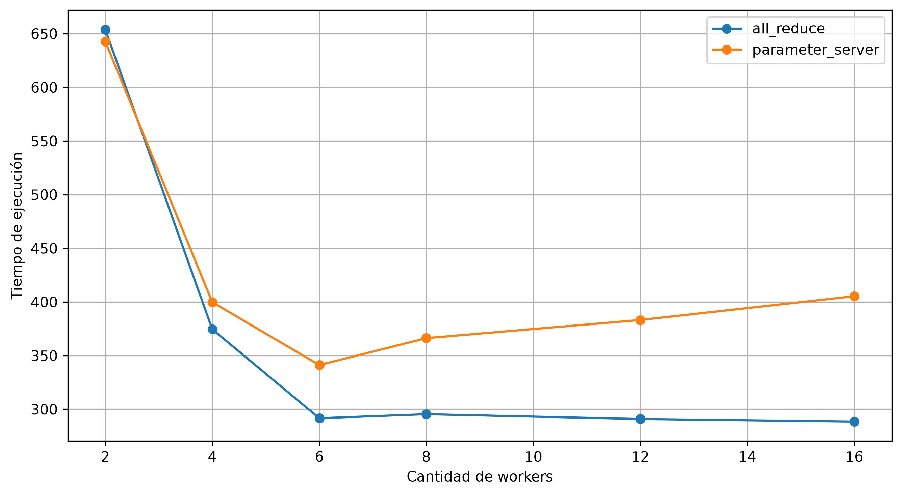
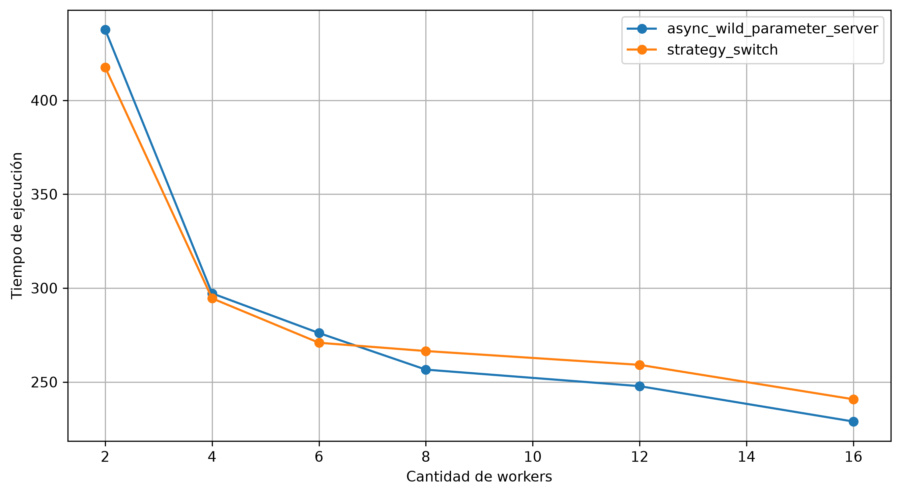
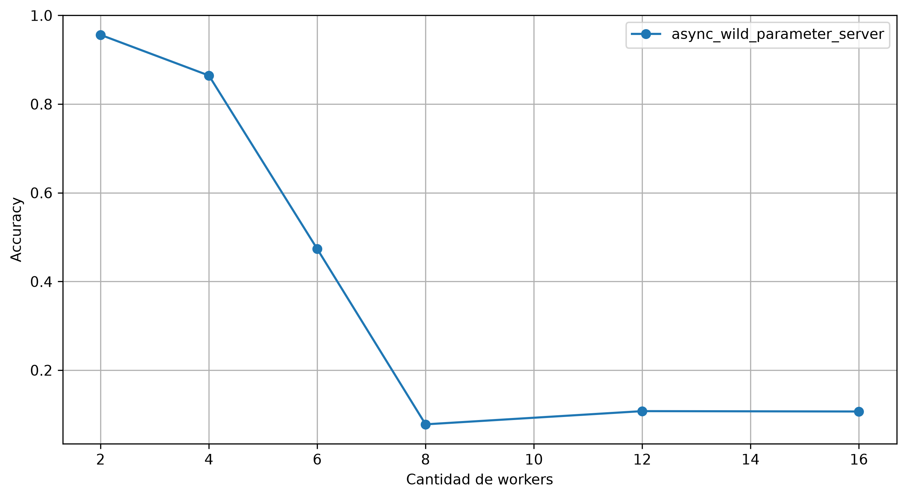
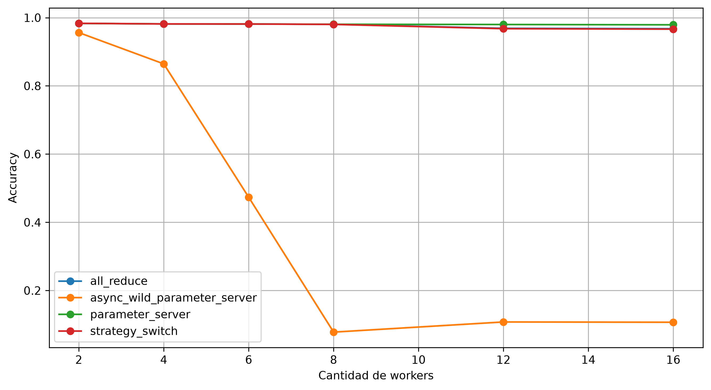

<!-- # NOTAS -->
<!-- - TODO, algo como: La penalización por no sincronizar frecuentemente se incrementa con la varianza del dataset. Cada nodo va a recibir una partición del dataset cuya superficie de error va a ser muy distinta a la de los demás. -->
<!-- - TODO: gráficos efficiency o speedup, time spent, después otro copado podría ser parameter server y gráfico de tiempo vs. cantidad de workers, con una curva base q es la cantidad con bandwidth infinita y la otra con bandwidth limitada y comparando con ambos resultados teóricos. -->
<!-- - TODO: quizás gráficos que muestren tiempo con workers fijos vs d_trans, o sea S/R, y por supuesto afectando únicamente a R porque no voy a tocar el modelo. -->
## Resultados
El objetivo principal de los algoritmos que se implementan en este trabajo es el de reducir el tiempo de entrenamiento de un modelo de deep learning, $T_1$, que está dado por la suma de $T_\text{ser}$ y $T_\text{par}$, los tiempos de procesamiento de las porciones de trabajo serializado y paralelizable, respectivamente.  
Dado que $T_\text{ser}\ll T_\text{par}$, pues, para los algoritmos que se presentan, el trabajo serializado consiste en compartir el dataset y la metadata del modelo entre los nodos, y que además $T_{ser}$ no cambia entre los algoritmos, porque en todos ellos necesita compartirse esa información; podemos despreciar $T_\text{ser}$ y hablar de $T_\text{par}$ como $T_1$ en el contexto de la comparativa.

En un mundo perfecto, donde el costo de sincronización de los nodos es despreciable, el tiempo de entrenamiento es inversamente proporcional a la cantidad de nodos $P$:
$$
T_P = \frac{T_1}{P}.
$$
Ahora bien, el mundo no es perfecto y el costo de sincronización no es despreciable; más aún, veremos más adelante que en algunos casos puede incluso crecer con la cantidad de máquinas que deben sincronizarse.

A continuación, se realiza un análisis de los tiempos de entrenamiento esperados para cada algoritmo y se los compara con los que fueron obtenidos con O.N.O.

El tiempo total de entrenamiento distribuido está dado por la combinación del tiempo de ejecución local y el delay de sincronización y de inicialización
$$
T_{total} = N_\text{epochs} * \left(\frac{T_{epoch}}{N_W} + d_\text{sync}\right) + d_\text{inicialización}.
$$
En un entorno de computación distribuida, una pasada por el dataset en cada epoch se divide entre la cantidad de workers que las computan.

Sin perder generalidad y conservando dinamismo, se opta por mostrar los resultados contra el dataset MNIST [@lecun1998gradient]. Como veremos a continuación, un factor clave en el delay de sincronización que introducen los algoritmos de entrenamiento distribuido es el tamaño del modelo $S$ con respecto al bandwidth $R$ de la red, es decir, el delay de transmisión $d_\text{trans}$ de la red.  
Para poder simular un ambiente multi computadora en una sola máquina con 16 cores, se usó Docker para limitar la cantidad de CPUs asignados a cada nodo y la herramienta Pumba para simular bandwidth limitado en la comunicación de red.  

Dado que el tamaño de los modelos que resultan útiles para aprender MNIST no es lo suficientemente grande para obtener diferencias observables entre los algoritmos, para tener una relación $S/R$ buena para evaluación, se configuró $R=10 \ \text{Mbps}$ subrealistamente bajo, de manera tal de evitar usar modelos innecesariamente grandes para MNIST o cambiar el problema a uno que así los requiera.  
El modelo que se entrenó es LeNet-5, que tiene 61706 parámetros. Como los parámetros y los gradientes se comparten en la red como números flotantes de 16 bits, el tamaño del modelo a los ojos de la red es de casi 1 Mb. El delay de transmisión es entonces aproximadamente $d_\text{trans}=1 \ \text{segundo}$.  
Se utilizó el optimizador Adam [@kingma2014adam] con learning rate 0.01 y batch size 64; por 48 epochs.  
Por último, el tiempo total de entrenamiento en una sola máquina, sin hacer uso de ningún algoritmo distribuido, es $T_1=600 \ \text{segundos}$.

| Parámetro            | Valores                                                                        |
|----------------------|--------------------------------------------------------------------------------|
| Dataset              | MNIST completo [@lecun1998gradient]                                            |
| Modelo               | LeNet-5                                                                        |
| Función de pérdida   | Entropía cruzada                                                               |
| Optimizador          | Adam ($\alpha=0{,}01$; $\beta_1=0{,}9$; $\beta_2=0{,}999$; $\epsilon=10^{-8}$) |
| Tamaño de mini-batch | 64                                                                             |
| Epochs               | 48                                                                             |
| $N_W$                | 2, 4, 6, 8, 12, 16                                                             |

: Configuración de los benchmarks. Parameter Server siempre se ejecuta con un único servidor.

### Parameter Server sincrónico con un solo servidor
En Parameter Server [@10.5555/2685048.2685095] con un solo server, el delay que introduce la sincronización del sistema está dado por el tiempo de comunicación de la ida de los parámetros del server hacia los workers, y de la vuelta de los gradientes de los workers hacia el server.  

Suponiendo un mismo bandwidth $R$ para todos los nodos, delays de encolado, propagación y procesamiento despreciables; y un modelo de tamaño $S$ ($S=N_\text{params} \times 2 \ \text{bytes}$, dado que los parámetros se serializan como flotantes de 16 bits); el tiempo que tarda la ida de los parámetros es el de su envío en $N_W$ mensajes unicast $N_W \frac{S}{R}$.  
Suponiendo un ambiente homogéneo, en el que el tiempo de procesamiento de los workers es similar, todos comienzan a contestar con los respectivos gradientes en simultáneo. Sin embargo, el server solo tiene una tarjeta de red con la cuál recibir estos gradientes, por lo que el tiempo que tarda la vuelta de los gradientes es también $N_W \frac{S}{R}$.  

El delay de sincronización de Parameter Server sincrónico con un solo servidor es entonces
$$
d_\text{sync, PS} = 2 N_W \frac{S}{R}.
$$
Nótese que el delay crece con la cantidad de workers.

Cabe destacar que generalmente uno querría que el nodo que ejecuta el parameter server ejecute también un worker, dado que de otra forma se estaría desperdiciando su CPU siendo que la entidad del server es I/O bounded. En cuyo caso el delay de comunicación entre el parameter server y el worker que residen en el mismo nodo se anula, y por tanto $d_\text{sync, PS} = 2 (N_W-1) \frac{S}{R}$.

### Ring All-Reduce
El delay de sincronización de Ring All-Reduce [@patarasuk2009bandwidth] está dado por el delay del *scatter* y por el delay del *gather*. Ambas etapas del algoritmo son de $N_W-1$ iteraciones. En ambas, la sincronización en una iteración consiste en enviar una $N_W$-ésima parte del gradiente del $i$-ésimo al $i+1$-ésimo nodo. Como despreciamos los delays de encolado, propagación y procesamiento; y como las tarjetas de red son *full-duplex* (tienen canales dedicados para leer y escribir), podemos pensar que la comunicación en anillo se realiza en paralelo.

Considerando los mismos supuestos de delays de comunicación por red que usamos para el desarrollo anterior, el delay de sincronización de All-Reduce, está dado por hacer dar vuelta una $N_W$-ésima parte del gradiente dos veces. Esto es
$$
\begin{aligned}
d_\text{sync, AR} &= 2(N_W - 1) \frac{S/N_W}{R}\\
&=2(1-\frac{1}{N_W}) \frac{S}{R}.
\end{aligned}
$$

A diferencia de Parameter Server, el factor afectado por la cantidad de workers $\frac{1}{N_W}\rightarrow 0$ cuando $N_W\rightarrow \infty$,
$$
\lim_{N_W\rightarrow \infty} d_\text{sync, AR} = 2 \frac{S}{R}.
$$
El delay de sincronización está acotado por el doble del delay de transmisión del tamaño de los parámetros del modelo.

### Parameter Server sincrónico con $N_S$ servers
Como ya vimos, la mayor parte del delay de sincronización en Parameter Server viene del hecho de que todos los workers tienen que comunicarse con un único servidor, y dado que este servidor puede enviar y recibir una sola tira de parámetros/gradientes a la vez, el delay escala con $N_W$.  
Una forma de resolver este problema es incrementar la cantidad de servidores. Cada servidor tiene una porción disjunta de los parámetros del modelo, y los workers solicitan parámetros y envían gradientes al servidor que corresponda.

En Parameter Server, por tratarse de comunicación de uno a muchos, el cuello de botella de la sincronización está del lado del servidor. Con un solo servidor ya vimos que el envío de parámetros y la recepción de gradientes ambos tardan $N_W \frac{S}{R}$, que es el máximo entre el delay desde el punto de vista de un worker y desde el del server: $\max{\left(\frac{S}{R}, N_W \frac{S}{R}\right)}$. Pero con $N_S$ servers, el delay del lado del servidor se transforma en $N_W \frac{S/N_S}{R}$. Por lo tanto
$$
d_\text{sync, Multi-PS} = 2 \frac{N_W}{N_S} \frac{S}{R} \qquad (N_S\leq N_W).
$$
Notar que cuando $N_S=N_W$, $d_\text{sync, Multi-PS} = 2 \frac{S}{R}$, que es el mismo resultado obtenido que para All-Reduce cuando $N_W$ crece indefinidamente.

Vale la misma aclaración que hicimos en el caso para un solo servidor con respecto a que los nodos que ejecutan un server normalmente van a estar también ejecutando un worker, por lo que los delays de transmisión se anulan en esos nodos: $d_\text{sync, Multi-PS} = 2 \frac{N_W-1}{N_S} \frac{S}{R}$.

### Parameter Server asincrónico
El delay de sincronización desarollado en los puntos anteriores se da luego de cada ronda de epochs de *todos* los workers. Esto es, cada worker computa una epoch (o más, si `offline_epochs` está configurado) para luego sincronizar sus parámetros con el resto.

Parameter Server asincrónico libera al entrenamiento distribuido de esta restricción, dejando que el parameter server mueva los parámetros del modelo a medida que van llegando gradientes de los workers *sin necesidad de esperar al resto*. En este caso el costo de sincronización se elimina porque la sincronización simplemente desaparece, aunque aún se tiene que considerar el delay de transmisión $2\frac{S}{R}$ de cada worker.  
El problema con esta estrategia es que la convergencia empeora mucho cuando la desincronización es grande, es decir, cuando los workers mueven demasiado los pesos en la dirección sesgada que les dicta su partición de los datos; fenómeno conocido como *client drift* [@mcmahan2017federated].

### Strategy-Switch
Strategy-Switch [@provatas2025strategyswitch] combina la convergencia de All-Reduce y la velocidad de ejecución de Parameter Server asincrónico. La idea es encontrar un buen mínimo local con el primer algoritmo para luego seguir bajándolo por medio del segundo.  
Si consideramos que $d_\text{sync}$ es el tiempo en el que los nodos permanecen sin realizar ningún cómputo, ni comunicarse directamente con otro nodo, por esperar que termine la sincronización, podemos decir entonces que luego del switch no está acotado inferiormente. En el peor de los casos, cuando todos los nodos se comunican con el parameter server en simultáneo, el delay llega a $d_\text{sync, PS}$.

El delay de sincronización de Strategy-Switch depende entonces de si se realizó el *switch*:
$$
d_\text{sync, SS} =
\begin{cases}
2(1-\frac{1}{N_W}) \frac{S}{R}, & \text{antes del switch (All-Reduce)}\\
d_\text{sync, Async PS}, & \text{después (Parameter Server asincrónico)}.
\end{cases}
$$
con $0\leq d_\text{sync, Async PS}\leq d_\text{sync, PS}$.

### Resultados obtenidos
Se muestra primero la comparativa de resultados de los algoritmos que operan de manera sincrónica.

{width=78%}

Podemos observar que el delay de sincronización hace que la performance de Parameter Server empiece a empeorar a partir de $N_W=6$. Por otro lado, la sincronización no empeora con la cantidad de workers para All-Reduce puesto que el delay está acotado, pero sí agrega una cota inferior al tiempo de ejecución.

A continuación se muestran los resultados obtenidos para Parameter Server asincrónico con un solo server y para Strategy-Switch.

{width=78%}

Los resultados son muy prometedores y muy similares para ambos algoritmos. Sin embargo, al examinar cómo evoluciona la accuracy obtenida sobre el set de test en Parameter Server asincrónico, nos encontramos con que la acumulación de gradientes de manera descontrolada arruina por completo los resultados de convergencia.

{width=78%}

El hecho de que cada worker empuje para su lado pesa mayormente al principio del entrenamiento, cuando los workers no se encuentran en mínimos locales acordados en conjunto.  
Strategy-Switch aprovecha la velocidad de la desincronización en el momento indicado para no perder la convergencia, cuando los mínimos locales si fueron consensuados de antemano. El resultado del híbrido es una convergencia similar a la de los algoritmos sincrónicos y, como ya vimos, una velocidad de ejecución similar a la del asincrónico.

{width=78%}
